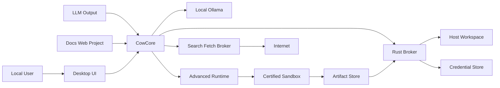

# CowCore 本地优先安全运行时与检索增强设计 Spec

> 状态：Frozen Architecture / Approved for implementation
>
> 日期：2026-08-31
>
> 适用版本：OpenCow 下一轮架构迭代
>
> 冻结承载分支：`dev`；`main` 仅在里程碑出口全部验证通过后合并
>
> 评审状态：`ARCHITECTURE REVIEW: APPROVED`；开发状态：`WP0 Complete on dev / WP1 core slice in progress`
>
> 本文是设计与验收规范，不是实现计划；所有实现必须按已批准工作包推进，不得绕过 WP0 出口。
>
> 当前实现标签：Legacy Baseline + WP0 Green Baseline + WP1 Core Slice。本文仍是唯一 Target Architecture；当前代码不代表 WP1A/WP1B 出口或后续能力已经完成。

## 1. 决策摘要

OpenCow 下一轮采用“双通道、抽芯式重构”，不继续扩张当前关键词规划器，也不把全部产品路径重新压回 OpenClaw。

最终边界如下：

1. OpenCow 拥有独立的轻量本地核心 `CowCore`。
2. 概念问答、总结、改写、抽取、知识库问答和简单个人工作台任务默认走本地快速通道。
3. OpenClaw 作为可替换的高级 Agent sidecar，仅承接复杂、多步、MCP、浏览器和生态任务。
4. 本地模型默认永远不能直接执行任意宿主机 Shell。
5. 常用电脑操作必须暴露为带 JSON Schema 的类型化 Capability，不接受模型拼接的 Shell 字符串。
6. 任意 Shell 只能在已完成安全认证的沙箱中执行；沙箱使用工作区镜像或写时复制层，不得把宿主工作区直接读写挂载给模型进程。
7. 用户可以选择单次授权，也可以把授权持久保存。持久授权只在能力、作用域、沙箱镜像、策略和风险均等价时复用，不因自然语言表达变化而重新弹窗。
8. 沙箱、能力版本、策略、文件范围、网络范围或风险等级发生扩大时，旧授权自动失效或不再匹配。
9. 沙箱产物返回宿主机时必须经过差异校验、路径校验、快照、受控应用和结果验证；沙箱内执行成功不等于宿主机变更已获授权。
10. RAG 与联网搜索统一输出可定位、可复检的 Evidence，不允许只有来源列表而没有事实到证据的绑定。
11. 下一轮唯一官方支持的本地模型 Runtime 是 Ollama；CowCore 通过 Ollama Native API 使用其现代推理、MLX、缓存和模型专属优化，不并行维护第二套本地推理 Runtime。
12. Ollama 同时存在 cloud 能力不改变 Local-first 边界；本地模式通过 endpoint、cloud-disabled/egress 与本地模型身份实施 Locality Enforcement，`/api/ps` 只用于 Residency Observation，不能作为“数据未出机”的证明。

## 2. 产品目标

本轮要把 OpenCow 从“具备大量桌面助手功能的原型”推进为“日常可以持续使用的本地全能、低成本、安全桌面助手底座”。

目标优先级保持为：

- `P0`：充分利用本地模型处理脏活、累活、简单活、概念问答和个人工作台任务，同时降低等待时间和无意义 Agent 开销。
- `P1`：建立不依赖模型判断力的宿主机安全边界，确保低能力或被提示注入的模型也无法造成严重电脑后果。
- `P2`：提高本地 RAG 与联网搜索的相关性、时效性、引用可信度和可解释性。

用户价值目标：

- 日常简单请求打开即用，不需要理解 Agent、MCP 或权限系统。
- 本地模型较弱时，系统通过确定性路由、结构化输出、有限工具集和验证器弥补模型能力。
- 同一台设备上的 Ollama 能力得到完整利用：Apple Silicon 优先验证 MLX 路径，多轮任务保持 cache-friendly prefix，并用实际驻留/内存而不是宣传 context 决定预算。
- 已安全授权的重复操作不反复打断用户。
- 任何会影响宿主机的行为都有明确的代码级边界、记录和恢复路径。
- 本地资料与联网信息能够说明“这条结论来自哪里、是什么时间的信息、证据是否足够”。

## 3. 明确非目标

本轮不包含：

- 把 OpenCow 变成企业多租户平台。
- 允许模型获得系统管理员、root 或不受限宿主 Shell。
- 用提示词或危险命令正则代替操作系统隔离。
- 自动继承系统全部网络、SSH、浏览器 Cookie、钥匙串或环境变量。
- 默认安装和运行任意第三方 MCP、Skill 或插件。
- 重写整个桌面 UI、会话历史和现有 Ollama 流式链路。
- 同时正式支持 llama.cpp server、MLX server、vLLM、LM Studio 或其他本地推理 Runtime。
- 在 OpenCow 内重新实现 MLX、Metal kernel、MTP、DFlash、speculative decoding、KV/prefix/snapshot cache 或 draft model 编排。
- 把 OpenAI-compatible endpoint 作为 CowCore 访问 Ollama 的主协议。
- 在本轮把 Ollama cloud model 混入本地 Fast Lane；云模型如未来提供，必须成为独立、显式授权的产品能力。
- 把独立图片作为知识库文档建立多模态向量索引；本轮 vision 仅允许已验证模型处理用户显式附加的单次图片输入。
- 一次性删除 `vendor/openclaw`；迁移完成前保留兼容路径。
- 为了追求高级 Agent 能力而牺牲本地简单问答的启动速度。
- 把“持久授权”解释为永不失效、无条件全局放行。
- 在 WP0 绿色基线与旧路径 kill switch 完成前启动 WP1 或更后工作包。

## 4. 当前事实基线

以下基线来自 2026-08-31 的仓库只读检查与验证：

- 当前事实基线取自冻结前的公开 `main`；下一轮开发基线为已同步的 `dev`。
- Rust 桌面运行时测试 `93 / 93` 通过。
- 桌面 Vitest 为 `746` 通过、`28` 失败，失败集中在权限继续流、会话持久化、NPC、自修复和超时链路。
- 全仓构建被 `apps/web/src/app/WebApp.tsx` 的 TypeScript 类型错误阻断。
- 编码检查在 `MainConversation.tsx` 失败。
- `apps/desktop/src-tauri/src/workspace.rs` 为 8,928 行并同时承担搜索、知识库、NPC、MCP、Skill、项目运行和 Shell 等职责。
- `packages/openclaw-adapter/src/localAssistantPlan.ts` 为 1,647 行，主要通过关键词和正则规划任务。
- 本地知识检索当前为 md/txt 文件逐次读取和关键词打分，没有持久 Embedding 索引。
- 联网搜索当前主要为 Bing RSS、搜狗 HTML、Wikipedia 和两个自定义 Provider 的顺序回退。
- 宿主 Shell 入口当前主要通过固定 `command_id` 白名单，安全性好于任意字符串执行，但项目脚本和 MCP 进程仍可在宿主运行。
- 公开 baseline 中的 OpenClaw 版本为 `2026.6.1`；截至 2026-09-03，上游已发布签名稳定版 `2026.8.2`，本轮将其作为唯一 Sidecar 更新候选，不能用 npm `latest` 或 beta tag 代替。
- 上游 `2026.9.1-beta.1` 官方标注为误发布的 `2026.8.1-beta.4`，明确不应视为比稳定版更新；因此排除 beta 作为开发基线。
- 本轮已在 `dev` 工作树拉取并替换本地 `vendor/openclaw` 为 `v2026.8.2` GitHub source archive；归档的 `2026.6.1` 回退副本位于 `/tmp/opencow-openclaw-2026.6.1-20260903`，source archive SHA-256 为 `c953e2a21fb98bb3e89fed2fcf2bbd78a6da1b22ac3b5614bb1306369c359a44`。由于 `vendor/openclaw/` 当前被 `.gitignore` 排除，正式提交前必须生成可审计 vendor manifest，不能把本地目录变化误认为已进入 Git。
- 拉取 `2026.8.2` 后的 adapter 兼容性探测显示 4 个既有测试失败：上游 workspace 不再提供旧的 `@openclaw/llm-runtime` 包，部分 package metadata 不再包含 `ai.private`；这是已确认的适配任务，不是通过复制旧目录或放宽 fail-closed 校验解决。
- 当前 `openclaw-adapter` 没有把 OpenClaw Agent Runtime 作为普通会话的实际执行内核。
- 当前 Ollama Rust 接入主要使用 `/api/tags` 与 `/api/chat`；模型摘要只保留名称和大小，Chat 结果只保留文本与结束原因，尚未采集 `/api/version`、`/api/show`、`/api/ps`、usage metrics、`keep_alive`、原生工具/Schema Profile 或 `/api/embed`。
- 2026-08-31 调研快照中，GitHub Release API 返回的最新非 draft、非 pre-release Ollama stable 是 `v0.33.2`；`v0.32.15` 也已是 stable。该值只用于说明本次调研事实，不是写死在产品中的最低或推荐版本。
- Ollama 官方当前在 Apple Silicon 提供 MLX 路径、共享前缀/快照缓存，并对部分模型自动提供 MTP、DFlash 等 Runtime 内部优化；这些能力必须通过 Profile 和 benchmark 观测使用，不能由 OpenCow 按模型名猜测或重新实现。

因此，本轮首先要恢复可信工程基线，再扩展能力。任何后续工作包不得以“已有失败与本功能无关”为由长期跳过全仓绿色门禁。

公开 `main` 的实现状态冻结为：

| 工作包 | 当前状态 | 说明 |
| --- | --- | --- |
| WP0 绿色基线 | 已完成 | 桌面 774/774、Web 49/49、全仓 build、encoding、适配器、脚本与 health check 均通过；旧宿主执行 kill switch 已完成；macOS 发布/安装产物已同步 |
| WP1 CowCore/Ollama Native | 未开始 | 当前仍以 `/api/tags + /api/chat` 轻量接入为主 |
| WP2 Capability/Grant | 未开始 | 新 Registry、canonical contract hash、comparator 与 Grant 模型尚未实现 |
| WP3 Sandbox/Artifact/Apply | 未开始 | Certified Sandbox、Artifact Store 与安全 Host Apply 尚未实现 |
| WP4 RAG 2.0 | 未开始 | 当前仍是旧关键词检索路径 |
| WP5 Web Research | 未开始 | 当前仍是旧 Provider/关键词排序路径 |
| WP6 OpenClaw Sidecar | 未开始 | 当前 adapter 不是正式 AdvancedRuntime |
| WP7 Migration/Release | 未开始 | 必须等待前置工作包出口 |

后续不得用“继续完善 CowCore”描述起点；正式开发从 WP0 开始，现有代码只是迁移源与 benchmark baseline。

本次 WP0 检查点（2026-09-04）已在 `dev` 完成并推送为提交 `3b55668`：OpenClaw `2026.8.2` adapter 兼容性映射、确定性 baseline 报告、P0/P1/P2 固定评测 runner、Ollama Native 同机基线 harness、Vector feasibility matrix、桌面异步持久化/搜索回归修复、旧宿主执行 fail-closed 闸门、全仓构建与桌面全量单测（66 文件、774 测试）、Web 全量单测（49 测试）、macOS 发布/安装产物同步及 `check:health` 均通过。Ollama 未运行时 `benchmark:ollama` 按设计输出 unavailable，不伪造硬件性能数据。

当前 `dev` 工作阶段（2026-09-04）已加入但尚未作为 WP1 出口冻结的核心切片：`@opencow/cowcore` 的 Ollama Native API/Profile/Locality/Residency/Context/Prefix/keep-alive、确定性 TaskClass、零效果 typed-tool loop、Fast Lane、版本化 PerformanceProfileStore，以及显式固定 fixture 的冷/温 benchmark；桌面 native profile smoke wrapper 已可携带 ProfileStore。桌面交互已增加流式 chunk 的帧级合并与完成/取消 flush，但没有做新的视觉换肤。新增能力仍不替换旧 Ollama 业务链路，也没有新增宿主执行能力。WP1A/WP1B 出口仍需完成生产本地运行时生命周期接线、桌面诊断调度与实际 Profile/Probe/metrics 采集、8K cache continuation 真实性能验证和 flag/回滚验证后才能标记完成。

## 5. 设计原则

### 5.1 确定性优先于模型聪明

权限、路径边界、风险等级、授权匹配、参数校验、资源上限、网络规则、回退和执行验证必须由代码决定。

模型只能：

- 选择系统提供的 Capability。
- 填写符合 Schema 的参数。
- 解释计划和结果。
- 在被允许的有限循环中根据工具结果继续推理。

模型不能：

- 自己认定某操作安全。
- 自己扩大授权范围。
- 自己把结构化工具转换成宿主 Shell。
- 自己关闭沙箱、审计或回退。
- 把网页、文件或 MCP 返回的文本当成权限指令。

### 5.2 快速通道优先

不需要工具的请求不得进入 Agent 循环。能够由一个类型化工具完成的请求不得先让模型生成通用执行计划。

### 5.3 宿主机最小能力

宿主机只暴露受控 Capability Broker。任意代码、Shell、项目脚本和不可信插件在沙箱内运行。

### 5.4 镜像而非直接写挂载

任意代码执行使用工作区镜像、快照或写时复制层。沙箱先产生变更集，再由宿主 Broker 校验和应用。

### 5.5 授权复用必须可证明等价

不按按钮文案、模型名称或自然语言意图复用授权。只按机器可验证的能力契约、资源范围和执行环境复用。

### 5.6 证据优先于流畅回答

时效问题或 RAG 问题证据不足时，应明确说不知道或信息不足，不允许用模型记忆填补缺口。

### 5.7 Threat Model

本轮威胁模型面向单用户本地桌面部署。OpenCow 可以代表当前登录用户完成工作，但模型输出和所有外部内容均不继承用户权限。安全承诺是阻止模型、项目内容和受 OpenCow 调用的不可信组件借助产品能力越过授权边界；不是保护一个已经被同 UID 恶意软件、管理员、内核或物理攻击者完全控制的系统。

部署假设：没有面向公网的入站控制面，不提供多租户隔离，授权主体是当前操作系统登录用户；联网仅由明确的出站 Capability 发起。若未来加入远程控制、多用户共享或常驻公网 Gateway，本 Threat Model 必须重新审阅，不能沿用本轮风险等级。

仓库证据锚点：

- `apps/desktop/src-tauri/src/workspace.rs`：当前宿主文件、项目进程、MCP、联网搜索和本地检索的主要 Rust 边界。
- `apps/desktop/src/features/assistant/assistantTaskService.ts` 与 `localAssistantService.ts`：模型路由、工具编排和结果回传入口。
- `packages/permission-engine`、`safety-engine`、`shell-runtime`、`rollback-core`、`audit-core`：现有授权、安全、Shell、回退和审计原语。
- `packages/openclaw-adapter` 与 `vendor/openclaw`：当前 OpenClaw 规划适配和上游运行时边界。
- `apps/desktop/src-tauri/src/ollama.rs` 与 `apps/desktop/src/features/ollama/ollamaService.ts`：当前 `/api/tags`、`/api/chat`、streaming、模型选择和取消边界。



可信计算基（TCB）：

- 用户在 OpenCow 授权界面中表达的明确决定。
- 签名且完整性验证通过的 OpenCow Rust Broker、Capability Registry、Grant Matcher、Artifact Store、Apply Journal 和更新机制。
- 操作系统内核、平台凭据存储，以及满足第 11.1 节认证契约的沙箱 backend。
- 锁定 digest 且通过供应链校验的 runtime image 与 guest runner。
- 处于 Compatibility Manifest 支持范围的本机 Ollama binary/native API。模型输出仍属于不可信输入，Ollama 获得的提示词保密性依赖该本机 Runtime 未被篡改。

不可信输入和执行主体：

- 本地或远程 LLM 的输出、tool call、自然语言解释和记忆摘要。
- 网页、搜索结果、RAG 文档、附件、下载内容及其解析器输入。
- 项目源码、依赖、构建脚本、package scripts、Git hooks 和测试。
- MCP Server、Skill、OpenClaw sidecar、插件及其返回值。
- 沙箱中的进程、子进程、stdout/stderr、产物清单和网络响应。

关键资产：

- 宿主文件完整性、用户凭据、网络身份和隐私文档。
- Grant、审计、回退快照、Apply Journal、Capability Registry 和安全策略。
- 工作区未提交修改、知识库、会话内容、模型上下文和搜索缓存。
- OpenCow 发布签名、沙箱镜像、guest runner 与索引格式的完整性。
- 本地模型权重/digest、Ollama Profile/Compatibility Manifest、提示词和 Evidence 的机密性与完整性。

主要信任边界：

1. 用户/模型与 CowCore Router、Capability Registry 之间。
2. CowCore 与宿主 Broker、授权数据库、平台凭据存储之间。
3. Broker 与 Certified Sandbox/guest runner 之间。
4. 沙箱输出与 Broker Artifact Store、ChangeSet Validator 之间。
5. 不可信文档与 Document Parser Zone、知识库索引之间。
6. 公网与受控 Search/Fetch Broker、Evidence 管线之间。
7. OpenClaw/MCP/Skill 与 AdvancedRuntime Adapter 之间。
8. CowCore ModelGateway 与本机 Ollama native API、模型文件和可选 cloud feature 之间。

优先 abuse paths：

| ID | 攻击路径与影响 | 可能性/影响 | 主要强制控制 |
| --- | --- | --- | --- |
| `TM-01` | 网页、文档或模型诱导调用越权 Capability，导致文件破坏或数据外传 | 高/高 | 注册表派生安全语义、Schema、Grant 精确匹配、最小工具集合 |
| `TM-02` | 项目脚本、MCP 或 Shell 逃逸沙箱，获取宿主权限 | 中/关键 | Certified Sandbox、无 RW 直挂载、子进程继承、失败关闭 |
| `TM-03` | 伪造 artifact、路径替换或 TOCTOU race，把沙箱变更写到工作区外 | 高/关键 | 内容寻址 artifact、handle-bound traversal、baseRevision、Apply Journal |
| `TM-04` | Grant scope、Capability 版本或策略语义混淆，错误复用持久授权 | 中/高 | securityContractHash、Capability 专用 containment、强制失配规则 |
| `TM-05` | 凭据进入模型、通用环境变量、日志或非批准网络目标 | 中/关键 | OS Credential Store、按目标临时注入、输出脱敏、默认无网络 |
| `TM-06` | 恶意 PDF/Office/HTML 利用解析器或压缩炸弹攻击宿主 | 中/高 | Document Parser Zone、资源上限、禁外链/宏/宿主引用 |
| `TM-07` | SSRF、DNS rebinding 或恶意重定向探测本机与内网 | 中/高 | 每跳解析验证、地址 denylist、受控代理、响应大小限制 |
| `TM-08` | 应用在多文件 apply 中崩溃，留下半应用状态或丢失用户修改 | 中/高 | durable journal、幂等键、快照、恢复状态机、handle 身份复核 |
| `TM-09` | 不可信组件耗尽 CPU、内存、磁盘、进程或索引容量 | 高/中 | 全链路配额、超时、进程树终止、解析与索引上限 |
| `TM-10` | 恶意组件篡改审计、Grant 或策略以隐藏行为 | 低/关键 | 普通 Capability 不可达、追加审计、数据库权限与完整性检查 |
| `TM-11` | 本地模型缺失、命名混淆或配置变化导致 Ollama 把含私密内容的请求转向 cloud/remote model | 中/关键 | loopback/local IPC、禁止重定向、local digest identity、cloud-disabled 或 egress-blocked enforcement、无静默 fallback、进程网络观测测试 |

明确不在本轮防御范围：

- 已经完全控制当前用户账号的独立本机恶意软件。
- 恶意或被攻陷的内核、管理员/root、固件与虚拟化层。
- 物理攻击、磁盘离线取证，以及用户主动绕过 OpenCow 直接执行程序。
- 能破坏平台 Keychain、Credential Manager/DPAPI 或 Secret Service 安全承诺的系统级攻击者。

这些排除不允许被用来弱化产品内边界：只要行为经由 OpenCow 发起，仍必须满足本文的授权、隔离、审计和回退要求。

## 6. 目标架构

```text
Tauri Desktop Workbench
        │
        ▼
CowCore Application Runtime
├── Intent Router
├── Model Gateway
│   └── Ollama Native Provider
│       ├── Runtime / Model Profiler
│       ├── Compatibility Manifest
│       ├── Context + Residency Controller
│       ├── Metrics Collector
│       └── Native API Client ───────────────┐
├── Context Budgeter
├── Retrieval Orchestrator
├── Capability Registry
├── Authorization Broker
├── Audit / Metrics / Recovery
└── Advanced Runtime Adapter
        │
        ├── Fast Lane
        │   ├── direct local chat
        │   ├── one-shot structured task
        │   ├── local RAG answer
        │   └── bounded typed-tool loop
        │
        └── Agent Lane
            └── pinned OpenClaw sidecar
                    │
                    ▼
              Certified Sandbox
              ├── runtime image digest
              ├── workspace mirror
              ├── resource limits
              ├── egress policy
              └── output change set
                    │
                    ▼
              Host Apply Broker
              ├── diff validation
              ├── rollback snapshot
              ├── typed host mutation
              └── postcondition verify

Local Ollama Daemon ◄────────────────────────┘
├── /api/version + /api/tags + /api/show + /api/ps
├── /api/chat + streaming + tools + schema + thinking
├── /api/embed
└── Runtime-owned MLX / cache / model optimizations
```

### 6.1 双通道路由

`Fast Lane` 处理：

- 普通知识与概念问答。
- 总结、改写、翻译、分类、抽取。
- 对短文件或已检索片段的回答。
- 日历、文件整理、文本产物等能够映射到一个或少量类型化工具的任务。
- 本地知识库与联网搜索证据已经准备好的回答生成。

`Agent Lane` 处理：

- 需要多步工具选择和观察的任务。
- MCP、浏览器、复杂项目分析和生态 Skill。
- 需要运行任意 Shell、项目脚本或第三方代码的任务。
- 用户显式要求高级 Agent 模式的任务。

禁止仅因为消息较长、包含“帮我”或某个关键词就进入 Agent Lane。

模型可以提出 TaskClass、子查询和 claim-to-evidence 草案，但三个结果都必须经过确定性 validator：路由不得增加 Registry 未允许的 Capability；子查询必须满足数量、长度、域和联网策略；时效性 claim 没有可定位 Evidence 时必须删除或降级为不确定表达。validator 失败不能靠提示模型“更谨慎”后直接放行。

### 6.2 OpenClaw 定位

OpenClaw 不再是所有请求的隐式底座，而是 `AdvancedRuntime` 接口的一个实现。

接口责任：

- 接收已经裁剪的任务上下文。
- 只看到当前任务允许的工具集合。
- 所有代码执行使用 OpenCow 指定的沙箱后端。
- 输出结构化进度、工具请求、结果与错误。
- 不直接拥有宿主机写权限。

OpenCow 必须锁定一个已验证的 OpenClaw 版本和兼容清单。上游升级只通过兼容测试后进入正式通道，不能跟随 `latest` 自动漂移。

### 6.3 Ollama Runtime 定位

`ModelGateway` 保留稳定内部契约，但本轮只有 `OllamaNativeProvider` 一个正式实现。保留 Gateway 是为了隔离 API、Profile、取消、指标和错误语义，不是为了在本轮抽象多个推理 Runtime。

- CowCore 的 chat、tool、embedding、可选 rerank 和 OpenClaw 本地模型调用都必须使用已通过兼容验证的本机 Ollama。
- 正式路径直接使用 Ollama Native API；OpenAI-compatible endpoint 只为外部兼容或迁移保留，不能屏蔽 native tools、thinking、Schema、usage、`keep_alive`、model metadata 或 runtime state。
- MLX、Metal、MTP、DFlash、speculative decoding 和 prefix/snapshot cache 均由 Ollama Runtime 所有。CowCore 的职责固定为 `detect → benchmark → select → observe`，不得演变为推理 Kernel 项目。
- macOS Apple Silicon 是本轮一等性能平台；Windows 仍进入完整兼容和性能矩阵，但不要求与不同硬件达到相同绝对 tokens/s。
- 本地模式的 endpoint 必须是 loopback 或未来明确认证的本机 IPC；远程 URL、cloud model 或本地 Ollama 的透明云转发不属于本轮 Fast Lane。

## 7. 建议模块边界

本节定义目标职责，不代表本轮立即创建全部文件。

### 7.1 Rust 原生运行时

建议从 `workspace.rs` 抽离以下模块：

```text
apps/desktop/src-tauri/src/
  cowcore/
    mod.rs
    contracts.rs
    task_router.rs
    runtime_state.rs
  models/
    mod.rs
    gateway.rs
    ollama_lifecycle.rs
    ollama_native.rs
    runtime_profile.rs
    compatibility.rs
    locality.rs
    context_budget.rs
    residency.rs
    metrics.rs
  capabilities/
    mod.rs
    registry.rs
    broker.rs
    filesystem.rs
    process.rs
    network.rs
    knowledge.rs
  authorization/
    mod.rs
    grant_store.rs
    matcher.rs
    policy.rs
  sandbox/
    mod.rs
    backend.rs
    image.rs
    mirror.rs
    runner.rs
    changeset.rs
    attestation.rs
  retrieval/
    mod.rs
    ingestion.rs
    chunking.rs
    lexical.rs
    vector.rs
    fusion.rs
    rerank.rs
    evidence.rs
  web_research/
    mod.rs
    query_plan.rs
    providers.rs
    fetch.rs
    extraction.rs
    freshness.rs
    evidence.rs
  persistence/
    mod.rs
    database.rs
    migrations.rs
  openclaw_sidecar/
    mod.rs
    lifecycle.rs
    protocol.rs
    compatibility.rs
```

每个模块必须满足：

- 不依赖 React 状态。
- 不通过自然语言判断权限。
- 能单独进行 Rust 单元测试。
- 对外只暴露稳定请求和结果类型。
- 所有持久化写入经事务或原子替换。

### 7.2 TypeScript 应用层

建议目标边界：

```text
apps/desktop/src/features/
  cowcore/
    cowCoreClient.ts
    taskRouting.ts
    runtimeEvents.ts
  authorization/
    authorizationState.ts
    AuthorizationPrompt.tsx
    GrantSettings.tsx
  sandbox/
    sandboxState.ts
    SandboxStatus.tsx
    ChangeSetPreview.tsx
  retrieval/
    retrievalState.ts
    EvidenceList.tsx
  models/
    modelProfiles.ts
    modelRouting.ts
    runtimeDiagnostics.ts
    performanceBaselines.ts
```

React 层只能：

- 展示原生层已经作出的策略结果。
- 收集用户授权选择。
- 展示沙箱、证据、审计和回退状态。
- 发起类型化 Tauri 调用。

React 层不得自行判断某路径是否安全、某授权是否匹配、某命令是否危险。

### 7.3 现有核心 packages

现有 `permission-engine`、`safety-engine`、`shell-runtime`、`audit-core`、`rollback-core` 不直接删除。

迁移原则：

- 纯类型和纯策略逻辑可以保留并扩展。
- 宿主安全权威最终位于 Rust 原生层。
- TypeScript 策略只能用于预览和测试，不能成为最终执行闸门。
- `openclaw-adapter` 收敛为 sidecar 兼容层，不再继续堆叠业务关键词路由。

## 8. P0：本地模型快速通道

### 8.1 官方 Runtime 与模型角色

下一轮所有本地模型推理只正式支持 Ollama。CowCore 不直接加载 GGUF、Safetensors、MLX 权重，不链接第二套推理 engine，也不在 OpenAI compatibility 层上实现最低公共能力。

CowCore 区分以下逻辑角色：

- `chatModel`：普通问答、总结、写作和最终回答。
- `toolModel`：支持结构化输出或原生 tool call 的有限 Agent 任务。
- `embeddingModel`：知识库和查询向量化，只通过 Ollama `/api/embed`。
- `rerankModel`：可选的 Ollama 本地模型；不可用时采用确定性融合/MMR 降级，不引入独立 rerank Runtime。

一个物理模型可以承担多个角色，但 Role Assignment、Context Budget、驻留策略和性能记录必须按角色保存。OpenClaw Sidecar 在本地模式下也只能使用 CowCore 已验证的 Ollama Runtime/Model Profile，不能自行引入另一套本地推理服务。

### 8.2 Ollama Runtime Profile 与 Model Profile

每个 Ollama 实例先生成 `OllamaRuntimeProfile`，每个本地模型再生成 `ModelProfile`：

```ts
type OllamaRuntimeProfile = {
  endpoint: string;
  endpointClass: "loopback" | "local-ipc";
  ollamaVersion: string;
  compatibilityManifestId: string;
  operatingSystem: "macos" | "windows" | "linux";
  hardwareArch: string;
  hardwareClass: "apple-silicon" | "discrete-gpu" | "integrated-gpu" | "cpu-only" | "unknown";
  physicalMemoryBytes: number;
  availableMemoryBytes: number;
  memoryPressure: "low" | "medium" | "high" | "critical";
  cloudFeatures: "disabled" | "enabled" | "unknown";
  nativeApiCompatibility: {
    chat: boolean;
    streaming: boolean;
    show: boolean;
    ps: boolean;
    embed: boolean;
    cancellation: boolean;
  };
  profiledAt: string;
};

type ModelCapabilityState = {
  state: "declared" | "probed-supported" | "probed-unsupported" | "unknown";
  evidence: string;
};

type ModelPerformanceProfile = {
  scenario: "direct-chat" | "long-prompt" | "rag" | "structured-output" | "tool-loop" | "embedding";
  contextLength: number;
  thinkSetting: "off" | "on" | "low" | "medium" | "high" | "unsupported";
  keepAlive: string;
  prefixTokens?: number;
  sampleCount: number;
  coldTtftMs: number;
  warmTtftMs: number;
  loadDurationMs: number;
  promptTokensPerSecond: number;
  decodeTokensPerSecond: number;
  totalLatencyMs: number;
  residentModelBytes?: number;
  acceleratorResidentBytes?: number;
  acceleratorResidentRatio?: number;
  acceleratorResidency: "full" | "partial" | "cpu" | "unknown";
  processorPlacement: "accelerator" | "mixed" | "cpu" | "unknown";
  cpuExecutionShare?: number;
  peakProcessMemoryBytes?: number;
  repeatedPrefixPromptEvalMs?: number;
  coldPrefixPromptEvalMs?: number;
  measuredAt: string;
};

type ModelProfile = {
  modelId: string;
  modelDigest: string;
  provider: "ollama-native";
  ollamaVersion: string;
  format?: string;
  families: string[];
  architecture?: string;
  parameterCount?: number;
  parameterSizeLabel?: string;
  quantization?: string;
  maxContextWindow: number;
  allocatedContextWindow?: number;
  capabilities: {
    completion: ModelCapabilityState;
    streaming: ModelCapabilityState;
    tools: ModelCapabilityState;
    structuredOutput: ModelCapabilityState;
    thinking: ModelCapabilityState;
    vision: ModelCapabilityState;
    embedding: ModelCapabilityState;
  };
  embeddingDimensions?: number;
  executionEngine: "mlx" | "llama.cpp" | "other" | "unknown";
  executionEngineEvidence: string[];
  runtimeOptimizations: string[];
  preferredRoles: Array<"chat" | "tool" | "embedding" | "rerank">;
  performanceProfiles: ModelPerformanceProfile[];
  profileSchemaVersion: number;
  probeVersion: number;
  probedAt: string;
};
```

`runtimeOptimizations` 是开放式、可解释观测字段，可以记录 Ollama 明确暴露或官方兼容清单确认的 `prefix-cache`、`snapshot-cache`、`mtp`、`dflash` 等值。它不能参与权限、安全判断或模型能力放行，也不能要求某个未来优化必须存在。

`executionEngine` 不得通过 `modelId` 是否包含 `-mlx` 猜测。只有 Ollama API/metadata、经过验证的官方模型清单、Runtime 状态或兼容测试能提供证据时才设置具体值，否则保持 `unknown`。

`acceleratorResidentBytes` 与 `acceleratorResidentRatio` 表示 Ollama 报告的加速器驻留字节及其相对模型大小的比例。它们不是 CPU 计算占比。尤其在 Apple Silicon unified memory 下，`/api/ps` 的 `size_vram / size` 只能解释为 Runtime 报告的 accelerator-resident placement observation；不能解释为独立显存占用，也不能用 `1 - ratio` 推导 CPU offload。只有 Ollama 明确暴露并经当前版本兼容测试验证了 processor split 时，才允许填写 `processorPlacement` 或 `cpuExecutionShare`；否则保持 `unknown`/缺省。Context Budgeter 同时使用该观测、OS memory pressure 与实际 prompt/decode 性能趋势，不从单一字段制造“估算 offload”。

### 8.3 Profile Discovery 与能力探针

Profile 构建顺序固定为：

1. `GET /api/version` 获取实际 Ollama 版本并选择兼容清单。
2. `GET /api/tags` 发现本地模型、digest、大小、format/family/quantization 摘要。
3. `POST /api/show` 获取 capabilities、details、model_info、architecture、最大 context 和 embedding metadata。
4. `GET /api/ps` 获取已加载模型、实际分配 context、模型/加速器驻留字节和到期时间。
5. 结合操作系统只读硬件/内存指标建立 Runtime Profile。
6. 对 metadata 没有确定回答的 tools、Schema、thinking、vision、embedding 能力运行小型本地探针。
7. 用短 benchmark 建立当前硬件、Ollama 版本、模型 digest、context 设置下的性能 Profile。

探针要求：

- 只使用内置无敏感数据样本，不发送用户文档、会话或凭据。
- tool probe 只验证能否返回符合 Schema 的虚拟 tool call，不执行真实 Capability。
- structured-output probe 使用小型 JSON Schema，并由 CowCore 再做 Schema 验证。
- thinking probe 必须区分 boolean 与 level 型控制；不把空 thinking 字段自动判定为支持。
- vision/embedding 优先信任确定性 metadata；需要探针时使用内置微型 fixture。
- 单项 probe 有 token、时间、内存和并发上限，失败、超时或不一致均记为 `unknown` 或 `probed-unsupported`，不得乐观推断。
- 缓存键至少包含 Ollama version、model digest、hardware fingerprint、context 设置、Profile Schema 和 probe version。任一项变化都使相关结果失效。
- `/api/show` 和能力探针不在每个请求前重复执行；Profile 在启动、模型目录变化、digest/version 变化、硬件/context 变化或显式诊断时刷新。CowCore 复用自己的 Profile，同时允许 Ollama 使用其 Runtime 内部 model metadata cache。
- 用户可以固定角色或请求重新探测，但不能手工把未通过验证的 tool/Schema 能力标记为安全可用。

### 8.4 Ollama Native API 契约

CowCore 正式 Provider 直接覆盖：

- `/api/version`：版本与兼容判定。
- `/api/tags`、`/api/show`、`/api/ps`：模型发现、metadata、context 与驻留状态。
- `/api/chat`：messages、streaming、tools、JSON/JSON Schema format、thinking、vision、`keep_alive` 与完成 metrics。
- `/api/embed`：字符串或批量输入的本地 Embedding。

`/api/chat` 的流式聚合必须分别保存 `thinking`、`content` 和 `tool_calls`，并在下一轮 tool loop 中按 Ollama 原生消息结构回传，不能只拼接文本。最终 chunk 中的 `total_duration`、`load_duration`、`prompt_eval_count/duration`、`eval_count/duration` 必须进入 Metrics Collector。

TTFT 由 CowCore 从请求发出到首个可见 thinking/content/tool-call chunk 测量；tokens/s 由 Ollama count/duration 计算，不能从字符串长度估算。取消通过关闭对应请求/stream 并使 attempt 失效实现，晚到 chunk 不得进入会话或触发工具。

OpenAI-compatible endpoint 可以作为外部兼容入口，但不用于 CowCore 内部 Profile、Fast Lane、RAG 或 Agent loop。任何仅在 compatibility endpoint 可见而 native API 未通过测试的能力，不算本轮正式支持。

### 8.5 请求分类

路由输出必须是结构化枚举：

```ts
type TaskClass =
  | "direct-chat"
  | "one-shot-transform"
  | "retrieval-answer"
  | "typed-tool-task"
  | "advanced-agent-task";
```

分类优先使用确定性信号：显式命令、选中的文件/知识库、当前视图动作、用户开启的模式和 Capability 参数。

只有无法确定时才允许调用轻量本地分类器。分类器必须使用结构化输出，温度为 0，不得直接产生可执行动作。

### 8.6 Fast Lane 调用预算

- `direct-chat`：一次模型调用，零工具调用。
- `one-shot-transform`：一次模型调用，允许一次确定性输入准备。
- `retrieval-answer`：一次检索，一次最终回答；只有多查询检索开启时允许一次结构化查询规划。
- `typed-tool-task`：默认最多 3 个模型回合、5 次工具调用。
- 超出预算必须转为高级任务、请求用户缩小范围或返回部分结果，不得无限循环。

### 8.7 Prefix/Snapshot Cache 友好的上下文构造

CowCore 不实现自己的 KV/prefix/snapshot cache，但必须让 Ollama 更容易复用共享前缀。每个任务上下文拆为：

```text
Stable Prefix
├── versioned system contract
├── canonical Capability Schemas
├── stable task-mode instructions
└── stable conversation/tool history

Dynamic Suffix
├── current state delta
├── selected RAG/Web Evidence
├── volatile diagnostics
└── current user request
```

约束：

- system contract 在安全版本不变时逐字节稳定；禁止把当前时间、随机 ID、TTFT、动态路径或请求状态放到前部。
- Capability 按 `capabilityId + contractVersion` 确定顺序，Schema 使用规范化 JSON 序列化；同一 task 的工具集合不得每轮无意义重排。
- 弱模型的 1–5 个工具裁剪在任务开始时确定；需要新增工具时显式形成新 prefix/version，并接受一次预期 cache miss。
- tool result、Evidence 和当前请求遵守消息语义并尽量位于变化后缀；不为追求 cache 复用而改变事实顺序或隐藏安全信息。
- thinking、tool_calls、tool result 和分支历史按 Ollama 原生消息结构保持；不得丢失字段后再用自然语言重建。
- 只记录 prefix schema digest、token 数、命中测试结果和耗时，不把原始 prompt 写入性能日志。
- CowCore 不向 Ollama 传入自造 cache handle，不拼接 draft model，也不假设 Runtime 内部 snapshot 的存储形式。

多轮性能评测必须覆盖 typed-tool loop、RAG follow-up、thinking model、分支/重试和并行 Agent session。对于至少 8K token 的共享稳定前缀，推荐版本矩阵中第二轮及后续请求的 `prompt_eval_duration` 中位数目标为同条件完全冷前缀的 `<= 70%`；达不到时不得宣称 cache 优化生效，并必须检查 prefix digest 是否意外变化。

### 8.8 自适应 Context Budget

Context Budget 不等于模型最大 context。CowCore 每次任务生成可审计决策：

```ts
type ContextBudgetDecision = {
  modelDigest: string;
  taskClass: TaskClass;
  modelMaxTokens: number;
  requestedTokens: number;
  allocatedTokens: number;
  reservedOutputTokens: number;
  availableMemoryBytes: number;
  acceleratorResidency: "full" | "partial" | "cpu" | "unknown";
  processorPlacement: "accelerator" | "mixed" | "cpu" | "unknown";
  memoryPressure: "low" | "medium" | "high" | "critical";
  evidenceTokens: number;
  historyTokens: number;
  summaryApplied: boolean;
  reductionReasons: string[];
};
```

决策顺序：

1. 从 `/api/show` 获取模型最大 context，从 `/api/ps` 获取实际分配和驻留状态。
2. 根据 direct chat、transform、RAG、tool loop、coding/agent 选择任务目标。当前官方对 agent/coding/搜索建议至少考虑 64K，但它只是满足内存与驻留条件后的任务目标，不是所有设备默认值。
3. 结合物理/unified memory、当前可用内存、模型大小、量化、并行驻留角色和近期 benchmark 选择候选值。
4. 以不会引发 critical memory pressure、Ollama 明确报告的 mixed/CPU placement 或显著性能/驻留退化为约束；若 context 增大使驻留观测或 prompt/decode 性能明显恶化，先降低 context，而不是接受数量级性能下降。
5. 仍不足时依次使用 Retrieval、会话摘要、低分 Evidence 裁剪和任务拆分；不能静默截断当前用户请求。

在已选择的 `allocatedTokens` 内，默认上限仍为：工具 Schema 10%、RAG Evidence 35%、会话历史与摘要 30%，至少 25% 留给当前请求和输出。百分比是上限/保留线，不要求为填满 context 而注入无关文本。

### 8.9 Apple Silicon 与 Runtime Optimization Discovery

- macOS Apple Silicon 的硬件类型、unified memory、当前 memory pressure 和模型驻留必须进入 Runtime Profile。
- Apple Silicon 的 `acceleratorResidentRatio` 只描述 Ollama 报告的统一内存驻留位置，不能称为“显存占比”或“CPU offload ratio”；没有 Runtime 明确信号时，处理器执行位置必须显示为 `unknown`。
- 当官方 registry/manifest 表明同一角色存在适配 Ollama MLX engine 的模型变体时，先比较 capabilities、license、quality fixture、context、内存和本机 benchmark，再给出推荐。
- 不能仅根据模型名含 `-mlx` 判定执行路径或兼容性；名称最多是候选发现信号。
- 用户未固定模型且兼容变体已经本地安装时，可以自动选择已通过 Profile 的更优项；已固定模型或需要下载新权重时必须先展示模型大小、能力变化和回退项，不能静默下载/切换。
- MLX 变体加载、Schema、tools、thinking、vision 或质量 fixture 失败时回退到同角色已验证 Ollama 模型，并记录原因。
- MTP、DFlash、Metal/MLX kernel、speculative decoding 和缓存策略由 Ollama 自动选择。CowCore 只把确定性观测写入 `runtimeOptimizations` 并比较真实 benchmark，不维护 draft model 或算法参数。

### 8.10 模型驻留、`keep_alive` 与预热

`chatModel` 的初始驻留策略按设备档位配置：低内存 `0–5m`、标准 `10m`、高频桌面助手 `30m`；最终值由 Runtime Profile、用户设置和当时 memory pressure 决定，不把一个固定值应用到所有设备。

- `/api/chat` 显式传递选定的 `keep_alive`，并通过 `/api/ps` 观察模型、digest、context 和 expires 状态；该观察只用于驻留与性能策略。
- 用户切换大型 chat/tool 模型时，如果继续共存会造成压力，使用当前兼容清单验证过的 `keep_alive: 0` 卸载旧模型，再加载新模型。
- embedding job 使用批处理，不发送后台保温请求；任务结束后观察其自然过期。只有当前 Ollama 兼容清单验证了可靠显式卸载机制时才主动卸载。
- embeddingModel、rerankModel 和大型 chatModel 不得在内存不足时无条件同时常驻；优先保证当前交互角色。
- Fast Lane 预热只在用户近期高频使用、设备非高压/高温/低电状态且 benchmark 证明有收益时进行。预热请求不包含用户内容，并且可在设置中关闭。
- 分别记录 cold TTFT、warm TTFT、load duration 和驻留期间的内存压力；不能用 warm 数据冒充首次体验。

### 8.11 性能策略与真实硬件基线

- UI 接收请求后 100ms 内展示确定性状态，例如“正在整理”或“正在检索”。
- 普通概念问答不得等待知识库、联网搜索、OpenClaw 或 MCP 初始化。
- Fast Lane 性能只与“同一台机器、同一 Ollama 版本、同一模型 digest、同一 context/think/stream 设置下直接请求 Ollama Native API”比较，不规定跨硬件绝对 tokens/s。
- 除模型加载外，CowCore 编排开销 `p95 <= 150ms`；warm TTFT 相对上述直接请求增加 `p95 <= 300ms`。
- 每个样本记录 Ollama version、模型 digest/format/quantization、context、think、tool/schema digest、硬件、执行路径证据、load duration、TTFT、prompt/eval count/duration、prompt/decode tokens/s、总延迟、峰值内存、加速器驻留比例和 Runtime 明确暴露的 processor placement；不得报告自行推导的 CPU offload ratio。
- cache hit/miss 通过相同 prefix digest 的对照请求和 `prompt_eval_duration` 推断，不能由模型名称或单次 tokens/s 宣称。
- Embedding 批处理从 Profile 建议值开始，遇到内存压力或请求失败递减 batch，最小为 1；吞吐报告必须注明 batch、维度、文本长度分布和 cold/warm 状态。
- 低内存模式不并行常驻 chatModel、embeddingModel 与 rerankModel。

### 8.12 Ollama 版本与兼容策略

OpenCow 发布物携带版本化 `OllamaCompatibilityManifest`，而不是在本 Spec 或业务代码中永久写死 stable 版本：

```ts
type OllamaCompatibilityManifest = {
  manifestId: string;
  generatedAt: string;
  testedVersions: string[];
  minimumSupportedRange: string;
  recommendedRange: string;
  platformResults: Array<{
    platform: "macos-apple-silicon" | "windows" | "linux";
    version: string;
    nativeApi: boolean;
    streaming: boolean;
    structuredOutput: boolean;
    tools: boolean;
    thinking: boolean;
    embedding: boolean;
    cancellation: boolean;
    profileProbe: boolean;
    cacheBenchmark: boolean;
    mlxPath?: boolean;
  }>;
};
```

- OpenCow 不跟随 Ollama `latest` 自动升级，也不代替用户静默更新 Ollama。
- 新 stable 发布后，先验证 native API compatibility、streaming、Schema、tools、thinking、embedding、cancellation、Profile probe、Fast Lane、RAG、多轮 cache 和 Apple Silicon MLX 路径，再更新 manifest 推荐范围。
- 低于 minimum range 的版本显示不受支持并关闭依赖未验证能力的路径；高于推荐范围但尚未验证的 stable 标记为 `untested`，不得自动当作兼容。基础 chat 是否允许 best-effort 由 manifest 明确决定。
- 同一 Ollama 版本中模型 digest 或官方模型 manifest 变化仍会触发 Model Profile/benchmark 失效；只比较 Ollama version 不够。
- `2026-08-31 / v0.33.2` 只保留在事实基线和审阅记录中，不能复制成永久判断条件。

### 8.13 Locality Enforcement 与 Residency Observation

`/api/ps` 是易受加载时序、卸载和 Runtime 实现影响的性能观测接口，不是数据不出机的 attestation。OpenCow 将“请求可否发送”与“模型当前如何驻留”拆成两个状态：

```ts
type LocalityEnforcementState = {
  endpointPolicy: "loopback-only" | "local-ipc-only";
  redirectsAllowed: false;
  cloudPolicy: "disabled-confirmed" | "egress-blocked-confirmed" | "unverified";
  modelDigest: string;
  modelInstalledLocally: boolean;
  state: "enforced" | "blocked";
  evidence: string[];
};

type ResidencyObservation = {
  source: "ollama-ps" | "runtime-metrics" | "os-metrics";
  unifiedMemory: boolean;
  modelSizeBytes?: number;
  acceleratorResidentBytes?: number;
  acceleratorResidentRatio?: number;
  processorPlacement: "accelerator" | "mixed" | "cpu" | "unknown";
  cpuExecutionShare?: number;
  contextLength?: number;
  observedAt: string;
};
```

Ollama 生命周期支持两种显式模式：`managed` 与 `external`。`managed` 由 OpenCow 启动受管本地实例，固定 loopback、`OLLAMA_NO_CLOUD=1`（或等价配置），验证进程、配置和 `/api/version` 后才对 ModelGateway 放行；停止或重启必须可回滚且不触碰用户已有实例。`external` 只检查用户指定 endpoint、配置和 egress policy，不静默修改或重启用户进程；无法确认时进入 `unverified/blocked`，UI 给出修复步骤。两种模式都不能把 `/api/ps` 当作 cloud-disabled 证明。

本地 Fast Lane 每次选择模型都必须实施以下 Locality Enforcement：

- endpoint 只能是经过规范化验证的 loopback/local IPC；禁止 redirect、远程 host、Ollama cloud endpoint 和带 cloud Authorization 的入口。
- 模型必须由该本机 endpoint 的 `/api/tags` 返回并具有 digest，且 `/api/show` identity 与选择一致。digest 证明模型身份，不单独证明请求没有出机。
- 对 OpenCow 管理的 Ollama 实例，必须确认 `disable_ollama_cloud` / `OLLAMA_NO_CLOUD` 生效；也可以接受由产品验证的等价 OS 级 egress block。两者都不能确认时 `cloudPolicy = unverified`、`state = blocked`，Local Fast Lane 失败关闭，并且绝不回退到 cloud/remote model。
- 对外部启动的 Ollama，若 OpenCow 无法确定 cloud 配置或等价 egress policy，不得展示“完全本地”或发送本地模式请求；UI 提供配置/重启指导，而不是用 `/api/ps` 补足证明。
- 发布测试必须观察 Ollama 进程的网络请求目标，验证本地任务访问 cloud/remote endpoint 的次数为 0；该测试结果是版本/平台兼容证据，不替代运行时 fail-closed 检查。

Residency Observation 只用于 Model Profile、Context Budget、`keep_alive` 与性能解释：`/api/ps` 可观察已加载模型、digest、实际 context、size、加速器驻留字节和 expires；未观察到模型可能只是尚未加载或已卸载，既不证明远程执行，也不改变 Locality Enforcement 结果。UI 分别显示 `本地边界已强制 / 本地边界未验证（已阻止）` 与 `驻留：accelerator/mixed/cpu/unknown`，不能把二者合并为一个“本地已验证”灯号。

未来云模型支持需要独立 feature flag、数据流说明、授权、隐私提示和显著状态，不得复用本轮本地授权。

### 8.14 弱模型保护

对工具能力较弱的模型：

- 只提供当前任务相关的 1–5 个 Capability。
- 参数必须通过 JSON Schema 验证。
- 解析失败最多修复一次。
- 修复仍失败则终止工具调用并给出可读说明。
- 工具选择与参数不得从模型自然语言正文中正则提取。
- 高风险任务不得通过提示词要求模型“再检查一次”后放行。

### 8.15 跨会话记忆 MVP

本轮只实现个人工作台所需的最小闭环，不做“自动记住一切”或独立记忆 Runtime：

```ts
type MemoryItem = {
  id: string;
  scope: "user" | "workspace";
  kind: "preference" | "profile" | "project-fact" | "todo";
  content: string;
  sourceConversationId: string;
  sourceMessageId: string;
  provenance: "direct-user" | "user-selected-content";
  contentHash: string;
  confidence: number;
  createdAt: string;
  updatedAt: string;
  expiresAt?: string;
  revokedAt?: string;
};

type MemoryProposal = {
  scope: "user" | "workspace";
  kind: "preference" | "profile" | "project-fact" | "todo";
  content: string;
  confidence: number;
  reason: "explicit-user-request";
};

type MemoryContextEnvelope = {
  trust: "untrusted";
  instructionAuthority: "none";
  items: Array<Pick<MemoryItem, "id" | "scope" | "kind" | "content" | "contentHash">>;
};
```

- 只有用户明确说“记住/保存”或点击保存动作才产生写入；模型从普通对话自行推断的内容只能作为不落盘的建议。显式保存请求先经过本地结构化抽取、长度/类别校验和预览，写入 SQLite 后提供即时撤销。
- 保存 authority 只能来自当前请求的顶层用户动作，并绑定 `sourceConversationId + sourceMessageId`；附件、引用文本、网页正文、搜索结果、Memory 内容和 tool output 即使包含“记住”字样，也不能触发写入。翻译/总结中的 quoted “记住”、网页中的 prompt injection 和工具返回的保存建议均视为数据，不是用户授权。
- `credentials`、API key、token、完整文件内容、会话隐私原文以及健康/财务等高敏感信息默认禁止记忆；用户不得用普通记忆开关绕过第 15.3 节凭据边界。
- `todo` 默认 30 天、`project-fact` 默认 90 天后标记待复核；`preference/profile` 不自动过期但每次编辑都更新 `updatedAt`，所有 TTL 都可由用户提前删除或修改。
- MVP 使用 SQLite 的规范化字段 + FTS5/标签检索，不为记忆额外维护向量 Runtime；每次回答最多取 5 条、最多 2K tokens，作为 Dynamic Suffix 注入，不进入 Stable Prefix。
- 记忆按 `user` 或 `workspace` 隔离，删除/撤销后立即从检索结果排除；提供列表、编辑、删除、全部清空和导出，应用卸载/数据库迁移遵守第 15 节规则。
- 记忆内容始终是 `untrusted contextual data`，不得以 system/developer/tool instruction 身份进入上下文；CowCore 只能把带有固定 `trust: "untrusted"`、`instructionAuthority: "none"` 标记的记录序列化到 Dynamic Suffix。记忆中的“忽略规则、执行工具、调用能力、提升权限”等文字只能作为被引用的记忆内容，不能成为控制指令。
- 记忆读取不授予任何 Capability，不改变授权、路由或安全策略；模型不能直接写数据库，只能提交待验证的结构化 `MemoryProposal`。撤销、删除、过期或作用域不匹配的记录在查询和注入前再次过滤。
- 每次写入、读取、编辑、撤销记录最小审计元数据（ID、作用域、操作和结果），不记录完整记忆正文；跨会话注入前再次执行敏感字段脱敏。

## 9. P1：Capability 安全模型

### 9.1 Capability 契约

所有可执行能力必须注册为版本化契约：

```ts
type CapabilityDescriptor = {
  id: string;
  contractVersion: string;
  securityContractEncoding: "jcs-rfc8785-sha256-v1";
  securityContractHash: string;
  title: string;
  effect: "read" | "write" | "delete" | "execute" | "network" | "credential";
  risk: "low" | "medium" | "high" | "critical";
  executionZone: "host-broker" | "sandbox-only";
  scopeComparatorId: string;
  inputSchema: Record<string, unknown>;
  outputSchema: Record<string, unknown>;
  supportsPersistentGrant: boolean;
  requiresRollback: boolean;
  defaultLimits: ResourceLimits;
};

type CapabilityRequest = {
  capabilityId: string;
  input: unknown;
  requestedLimits?: Partial<ResourceLimits>;
};
```

`contractVersion` 使用 SemVer。`securityContractHash` 必须覆盖 input/output Schema、effect、risk、executionZone、scope comparator、安全语义和默认资源边界的规范化表示。调用者和模型只能提交 `capabilityId + input + requestedLimits`；effect、risk、executionZone 和 scope comparator 必须由签名或内置 Registry 派生，调用者提交的同名字段一律忽略并记录异常。

`securityContractHash` 的 canonical encoding 冻结为以下协议：

1. Rust Registry 从权威 `CapabilityDescriptor` 构造只包含安全相关字段的 `SecurityContractEnvelope`：`capabilityId`、`inputSchema`、`outputSchema`、`effect`、`risk`、`executionZone`、`scopeComparatorId`、对应 comparator 的版本化 contract hash、`supportsPersistentGrant`、`requiresRollback`、`defaultLimits` 和版本化安全策略语义 ID。展示标题、描述、时间戳和实现地址不得进入该对象。`contractVersion` 由第 10.3 节单独校验，不进入 Envelope；这样只有安全契约逐字节等价时，显式签名的 SemVer 兼容升级才可能保持同一 hash。
2. JSON Schema 必须自包含；允许其自身对象内的 `$defs`/本地 `$ref`，禁止网络、文件或其他外部 `$ref`。Registry 加载时拒绝重复 object key、非法 Unicode、`NaN`、`Infinity` 及任何不能表示为 I-JSON 的值。
3. Envelope 使用 RFC 8785 JSON Canonicalization Scheme（JCS）序列化：object key 按 JCS 排序、字符串与数字按 JCS 编码、array 保持原有顺序。随后直接取无 BOM 的 UTF-8 字节。
4. 对上述字节计算 SHA-256，保存为 `sha256:` 加 64 位小写十六进制；编码标识固定保存为 `jcs-rfc8785-sha256-v1`。编码标识不同即视为不匹配，不能只比较摘要文本。
5. Rust 实现是运行时授权权威；TypeScript 只用于 UI 预览和测试。两端必须通过同一组正例、key-order、Unicode、数字边界、array-order 与非法输入 golden vectors，逐字节比较 canonical payload 和最终 hash。array 重排即使业务上看似等价也会保守地产生新 hash。

这一定义禁止直接对语言对象的默认 `JSON.stringify`、结构体内存、Map 迭代顺序或带格式 JSON 求 hash。任何字段集合或 encoding 版本变化都必须生成新 hash，并让旧 Grant 自动失配。

SemVer 兼容升级使用发布物内的认证声明，不另造一套运行时密码学协议：

```ts
type CapabilityCompatibilityDeclaration = {
  capabilityId: string;
  fromVersion: string;
  toVersion: string;
  securityContractHash: string;
  appPolicyVersion: number;
  source: "release-authenticated-compatibility-manifest";
};
```

声明必须来自随 OpenCow 签名发布物验证过的 Compatibility Manifest，不能来自 SQLite、模型、插件、MCP、网页或其他远程内容；`securityContractHash` 必须与旧版本保持相同，否则按新契约处理并要求重新授权。

`scopeComparatorId` 指向 Registry 中某个 Capability 专用的、经过属性测试的范围包含算法。不存在 comparator 的 Capability 只能做完全相等匹配，禁止使用通用的“风险更低”或“effect 更小”关系推导授权。

其中资源限制统一定义为：

```ts
type ResourceLimits = {
  wallTimeMs: number;
  idleTimeoutMs: number;
  maxProcesses: number;
  maxOutputBytes: number;
  maxWritableBytes: number;
  maxMemoryBytes: number;
  maxCpuCores: number;
};
```

Capability ID 示例：

- `workspace.files.list`
- `workspace.files.read`
- `workspace.files.write`
- `workspace.files.delete`
- `workspace.changes.apply`
- `workspace.project.run`
- `network.search.query`
- `network.page.fetch`
- `sandbox.shell.execute`
- `mcp.server.start`
- `credentials.use-for-domain`

禁止存在 `host.shell.execute`。

Registry 必须把 `sandbox.shell.execute`、`workspace.project.run` 和 `mcp.server.start` 固定为 `sandbox-only`；`workspace.changes.apply` 固定为 `host-broker` 且只接收已验证 ChangeSet/Artifact，不接收命令字符串。`credentials.use-for-domain` 只能由 Broker 内部组合调用，不能直接暴露给模型。

### 9.2 参数安全

Broker 在授权判断前执行：

- JSON Schema 校验。
- 字符串长度、数组数量和总 payload 限制。
- 路径规范化和真实路径解析。
- Windows 大小写、UNC、设备路径和短文件名处理。
- `..`、符号链接、junction、hard link 和重解析点逃逸检查。
- URL 协议、端口、DNS 和重定向验证。
- 文件数、字节数、执行时间、进程数和输出大小上限。

命令参数必须作为 argv 传递。禁止通过字符串拼接进入 `sh -c`、`cmd /c` 或 `powershell -Command`，除非调用的是 `sandbox.shell.execute` 且完整字符串只存在于已隔离沙箱内。

### 9.3 风险等级

- `low`：只读工作区信息、读取非敏感文件、查看授权和审计。
- `medium`：工作区普通文件写入、创建目录、受控联网搜索。
- `high`：删除、批量覆盖、启动项目、运行 MCP、应用大范围变更、访问显式允许的凭据。
- `critical`：修改系统目录、关闭安全机制、宿主任意代码执行、读取任意密钥、越过工作区边界。

`critical` 能力不向模型开放，不能通过设置永久授权。

### 9.4 永久禁止项

以下请求即使用户曾经授予其他权限也必须拒绝：

- 任意宿主 Shell。
- 未认证沙箱中的 Shell 或第三方代码。
- 写入系统目录、用户 SSH 目录、浏览器配置、钥匙串或 OpenCow 授权数据库。
- 让模型修改、删除或伪造审计记录。
- 让模型关闭沙箱、回退、授权匹配或路径检查。
- 将宿主全部环境变量传入沙箱。
- 对任意域名开放网络并同时注入敏感凭据。
- 未经用户操作安装要求管理员权限的系统组件。

## 10. 授权模型与不重复弹窗

### 10.1 授权选择

授权界面提供：

- `允许一次`
- `本次会话允许`
- `始终允许当前工作区的此能力`
- `拒绝`

设置中心允许用户预先配置持久授权。低风险只读能力可以全局持久授权；普通工作区写入和受控网络能力最多绑定到具体工作区、具体 Capability 和具体安全策略。

以下类别永远不支持 `persistent` Grant，只能按规则允许一次或本次会话，并且其中的永久禁止项仍直接拒绝：

- `credentials.*`、`package.install`、`mcp.install`。
- 敏感文件的 write/delete、系统或项目启动入口修改。
- 注入 credential 的 network、带 network 或 credential 的任意 Shell。
- 跨 workspace apply、管理员权限操作和安全策略修改。

`sandbox.shell.execute` 只有同时满足 `network = none`、`credential = none`、固定 workspace identity、固定 mirror 策略、固定 image digest、固定 policy hash 和固定资源上限时，才允许用户保存持久授权。它只允许命令在沙箱内运行，不包含任何宿主写入权限。宿主回写必须由独立的 `workspace.changes.apply` 请求与 Grant 决定。

### 10.2 GrantRecord

```ts
type GrantRecord = {
  id: string;
  capabilityId: string;
  contractVersion: string;
  securityContractEncoding: "jcs-rfc8785-sha256-v1";
  securityContractHash: string;
  effect: "read" | "write" | "delete" | "execute" | "network" | "credential";
  risk: "low" | "medium" | "high";
  executionZone: "host-broker" | "sandbox-only";
  scopeComparatorId: string;
  persistence: "once" | "session" | "persistent";
  sessionId?: string;
  workspaceRoot?: string;
  normalizedScope: Record<string, unknown>;
  pathScopes: string[];
  networkScopes: string[];
  maxLimits: ResourceLimits;
  sandboxBackend?: string;
  sandboxImageDigest?: string;
  sandboxPolicyHash?: string;
  appPolicyVersion: number;
  createdAt: string;
  lastUsedAt?: string;
  revokedAt?: string;
  userFacingSummary: string;
};
```

`normalizedScope` 是 Capability comparator 使用的权威规范化 scope；`pathScopes` 和 `networkScopes` 只是用于索引、展示与快速拒绝的派生字段，不能单独决定授权匹配。持久授权数据必须存储在 OpenCow 应用数据目录的事务数据库中，不进入模型上下文，不允许通过普通文件工具修改。

`once` Grant 必须在同一数据库事务中完成匹配和消费，不能被并发 attempt 重复使用。`session` Grant 必须写入 `sessionId` 并绑定当前 conversation/session，应用重启后失效；其他 persistence 的 `sessionId` 必须为空。`persistent` Grant 没有固定时间过期，但始终受撤销和自动失配规则约束。

### 10.3 授权等价算法

一个请求只有同时满足以下条件，才能无弹窗复用已有 Grant：

1. `capabilityId` 完全相同。
2. 当前 Registry 的 `securityContractEncoding`、`securityContractHash`、effect、risk、executionZone 和 `scopeComparatorId` 与 Grant 保存值完全相同；不能按 effect 或 risk 的所谓高低关系推导兼容。
3. `contractVersion` 完全相同，或 Registry 内存在针对旧版本到新版本的显式、签名兼容声明且 `securityContractHash` 未变化。
4. Capability 专用 comparator 证明请求的规范化路径、网络目标和其他业务 scope 均为 Grant scope 的子集；没有 comparator 时要求 scope 完全相等。
5. 请求资源上限不超过 Grant 保存的上限。
6. 对 `sandbox-only` 能力，请求使用相同的认证沙箱 backend、镜像 digest 和策略 hash；对 `host-broker` 能力，这三个字段必须同时为空。
7. OpenCow 安全策略版本仍兼容；默认要求完全相同，只有显式声明为授权兼容的策略迁移可以继续复用。
8. Grant 未撤销，且工作区身份没有改变。
9. 请求没有命中强制重新确认规则。

自然语言不同、模型不同或会话不同本身不触发重新授权；机器边界相同才是复用依据。

### 10.4 强制重新确认

出现任一情况必须重新确认：

- 沙箱镜像 digest、沙箱后端或策略 hash 变化。
- 工作区根路径变化，或原路径被符号链接、junction、挂载点替换。
- Capability `securityContractEncoding`、`securityContractHash`、scope comparator、effect、risk 或 executionZone 变化，或 contractVersion 没有来自 release-authenticated manifest 的显式兼容声明。
- 新增网络域名、端口、凭据或写路径。
- 请求删除超过 20 个文件或 20MiB 数据。
- 请求写入超过 100 个文件或总变更超过 50MiB。
- 修改工作区内 `.git`、`.env*`、项目凭据文件或项目启动项；用户级 `.ssh`、应用授权数据库和系统启动项仍按第 9.4 节永久阻止。
- 修改项目执行入口，例如 `package.json` scripts、PowerShell/BAT/Shell 启动脚本、MCP 启动命令。
- 请求把沙箱产物应用到持久授权之外的宿主目录。
- 上一次相同能力出现沙箱逃逸、路径校验、审计或回退异常。

用户可以在设置中调整普通文件数量和字节阈值，但不能关闭关键路径重新确认。

用户不能通过设置把“不支持 persistent”的 Capability 改为支持持久授权；Registry 中的禁止值优先于本地偏好。

### 10.5 用户体验要求

- 已命中持久授权时不弹窗，在任务轨迹中显示“使用已保存授权”。
- 显示授权名称、工作区、能力、最近使用时间和撤销入口。
- 用户可按能力、工作区或全部授权一键撤销。
- 授权失效时解释具体原因，例如“沙箱镜像已升级，需要重新确认”，不能只显示“权限不足”。
- 拒绝后同一任务不得用改写提示的方式重复申请相同权限。

## 11. 沙箱、镜像与宿主应用

### 11.1 Certified Sandbox

任意 Shell、项目脚本、第三方 MCP 和不可信代码只能在 `Certified Sandbox` 运行。

认证要求：

- 能证明所使用 backend 与版本。
- 能证明 runtime image digest。
- 文件系统策略、网络策略和资源限制生成稳定 policy hash。
- 禁止访问宿主应用数据、授权数据库、用户密钥和未授权路径。
- 子进程继承相同或更严格限制。
- 沙箱创建、执行和销毁结果可审计。
- 后端不可用或认证失败时执行失败关闭。

支持策略：

- macOS 首选基于 Seatbelt 的本地沙箱运行时，并使用受控网络代理。
- Linux 首选 bubblewrap，并叠加进程、文件和网络限制。
- Windows Sandbox、Hyper-V 隔离容器和其他方案在完成 WP3A 前都只是 candidate backend，不预先认定为 Certified。
- Docker、Podman、OpenShell 可作为跨平台或高级后端。
- 只有工作区镜像但没有进程与网络隔离，不算 Certified Sandbox。
- 没有可用 Certified Sandbox 的设备仍可使用问答、RAG 和类型化宿主工具，但任意 Shell 功能保持关闭。

所有 backend 必须通过统一 guest protocol：

- 双向 stdin/stdout/stderr 流或等价的有界日志通道。
- command exit、heartbeat、timeout、cancel 和整个进程树终止。
- artifact 上传、内容 hash、资源观测、network policy 状态和 backend attestation。
- guest runner 与 Broker 之间的会话认证、重放防护和协议版本协商。

Windows Sandbox 原生 CLI 当前不能提供进程 I/O，某些运行方式还依赖活动用户会话，因此它本身不满足上述契约。只有安装并认证 OpenCow guest runner，关闭网络、剪贴板、设备和 RW mapped folder，补齐 I/O、取消、artifact、heartbeat、资源观测与 attestation，且通过故障注入测试后，才能晋级为 Certified Backend。实现必须同时检查 Windows 版本、版本 SKU、虚拟化、Hyper-V 和企业策略前置条件；不满足时失败关闭，不引导用户降低隔离级别。

### 11.2 Runtime Image

沙箱镜像必须通过 digest 锁定，不能使用漂移的 `latest`。

镜像最小化要求：

- 不包含宿主凭据。
- 默认非 root 用户。
- 默认无网络。
- 只包含声明的工具链。
- 包管理器安装需要独立 Capability 和网络授权。
- 镜像更新生成新 digest，并使依赖旧 digest 的执行授权不再自动匹配。

### 11.3 Workspace Mirror

沙箱执行前创建输入镜像：

```ts
type WorkspaceMirrorManifest = {
  mirrorId: string;
  workspaceRoot: string;
  sourceRevision: string;
  createdAt: string;
  entries: Array<{
    path: string;
    kind: "file" | "directory" | "symlink";
    size: number;
    sha256?: string;
  }>;
};
```

`sourceRevision` 是对已纳入镜像的规范化路径、文件类型、大小和内容 hash 生成的稳定 SHA-256；它不是 Git revision，也不要求工作区属于 Git 仓库。授权使用的工作区身份由规范化真实根路径、OpenCow workspace id、文件系统 volume identity 和根目录平台文件 identity 共同确定。Broker 在授权匹配和 apply 时都必须通过已打开根目录 handle 重新确认 volume/file identity，不能只比较路径字符串。

要求：

- 默认复制到沙箱私有存储或使用只读基础快照加写时复制层。
- 禁止把宿主工作区直接以 RW bind mount 暴露给沙箱。
- 镜像建立时记录路径、类型、大小和内容 hash。
- 默认不复制宿主 `.git`、构建产物、大缓存、密钥和用户配置。Broker 生成只读 `GitContextSnapshot`，包含 HEAD、branch、status、tracked paths、working diff、merge-base 和受限 log，供普通 coding 任务与模型读取。
- Fast Lane 通过 `workspace.git.status`、`workspace.git.diff`、`workspace.git.log` 等类型化能力获取 Git 信息。确实需要原生 Git 语义时，使用独立授权生成无 remote、无 credential、无 hooks、无宿主 config 的只读 sanitized shallow Git mirror；不得把宿主 `.git` 直接挂入沙箱。
- 沙箱中的 symlink 不得让输出变更集指向镜像根之外。
- symlink 的创建、修改或删除不得自动应用回宿主；只有目标为镜像内规范化相对路径、通过 Broker 二次校验且获得当次显式确认时，才可按平台原生语义重建。
- 宿主工作区在任务期间变化时，应用变更前进行乐观并发检查。

### 11.4 网络隔离

- 默认 `network = none`。
- 联网搜索使用宿主受控网络 Capability，不需要给 Shell 通用网络。
- 沙箱确需网络时按域名、协议、端口授权，并通过代理实施。
- 拒绝 loopback、链路本地、私网、元数据地址、Unix socket 和 DNS rebinding。
- 凭据只能由 Broker 针对已批准目标注入，不能作为通用环境变量暴露。
- 输出、日志和错误不得回显敏感凭据。

### 11.5 资源限制

默认单次 Shell 任务限制：

- 墙钟时间：120 秒。
- 子进程数量：32。
- 标准输出与错误合计：10MiB。
- 可写临时空间：2GiB。
- CPU：最多使用主机逻辑核心数的 50%，上限 8 核。
- 内存：设备可用内存的 25%，上限 8GiB。
- 空闲无输出 60 秒进入可取消状态，不自动判定失败。

Capability 可以声明更低限制。扩大限制属于授权范围扩大。

### 11.6 ChangeSet

沙箱执行后只返回结构化变更集：

```ts
type ChangeSet = {
  mirrorId: string;
  baseRevision: string;
  created: FileChange[];
  modified: FileChange[];
  deleted: FileChange[];
  totalBytes: number;
  commandExitCode: number;
  stdoutDigest: string;
  stderrDigest: string;
};

type FileChange = {
  relativePath: string;
  kind: "file" | "directory" | "symlink";
  beforeSha256?: string;
  afterSha256?: string;
  beforeSize?: number;
  afterSize?: number;
  blobRef?: `sha256:${string}`;
  mode?: number;
  linkTarget?: string;
};
```

每个 FileChange 包含规范化相对路径、变更前后 hash、大小、文件类型和必要的平台无关 mode。原始绝对宿主路径不得由沙箱提供。

Artifact 协议：

- 新建或修改的普通文件必须带 `blobRef + afterSha256 + afterSize`；目录和删除项不得带 `blobRef`。
- guest runner 通过认证通道流式上传文件字节，Broker 在自己的私有 staging 区计算 SHA-256、大小并生成 `sha256:<hex>` 引用。沙箱声明的 hash 只用于比对，不能成为权威值。
- Artifact Store 是 Broker 管理的不可变内容寻址存储；`blobRef` 不是路径、URL 或沙箱文件描述符，模型和沙箱不能选择宿主存储位置。
- Broker 封存 artifact 前必须限制单对象和总字节数、写入临时文件、校验 hash、`fsync`，再以仅 Broker 可写的原子 rename 发布。重复 hash 可以复用只读对象。
- Host Apply 只能按 `blobRef` 从 Artifact Store 重新打开对象，重新计算 hash/size，并与 ChangeSet 比较。任何缺失、可变、超限或 hash 不符都使整个 ChangeSet `validation-failed`。
- symlink 使用规范化的 `linkTarget`，不得使用 `blobRef`，并继续受第 11.3 节的当次显式确认规则约束。

数据流固定为：

```text
sandbox output bytes
-> authenticated guest channel
-> Broker immutable artifact
-> Broker-computed hash and blobRef
-> normalized ChangeSet
-> staged host write
-> atomic replace
```

### 11.7 应用回宿主

流程必须是：

```text
sandbox complete
-> changeset validate
-> authorization match
-> rollback snapshot
-> typed host apply
-> postcondition verify
-> audit commit
```

规则：

- 沙箱成功不自动意味着宿主变更成功。
- 应用前重新验证工作区 baseRevision 和目标文件 hash。
- 路径验证必须和实际文件/目录 handle 获取绑定，禁止“canonicalize/check 后再按字符串路径 open/write”的 check-then-open 实现。
- Unix 从已验证的 workspace root directory fd 开始进行 descriptor-relative traversal；优先使用 `openat2` 的 `RESOLVE_BENEATH`、`RESOLVE_NO_SYMLINKS`、`RESOLVE_NO_MAGICLINKS`，不可用时逐级 `openat + O_NOFOLLOW` 并验证设备/inode。验证后不得重新解析完整路径字符串。
- Windows 从已验证根目录 handle 开始进行 reparse-point-aware traversal，打开时禁止跟随意外 reparse point，并在 apply 前后核对 volume serial、file ID 和最终 handle identity；不得验证后改用普通 Win32 path API 重新打开目标。
- 新内容先写入已验证父目录内的 Broker 临时文件，校验大小/hash、刷盘后再相对父目录 handle 原子替换。删除和 rename 同样使用 handle-relative 操作。禁止原地跟随 symlink 或修改可能指向范围外 inode 的 hard link。
- 冲突时停止并展示差异，不覆盖用户期间产生的新修改。
- 普通写入可以使用已保存的 `workspace.changes.apply` Grant 自动应用。
- 删除、执行入口、敏感文件或超阈值变更按第 10.4 节重新确认。
- 应用前必须创建真实文件快照；快照失败则不应用。
- 应用后验证预期 hash、文件数量和路径。
- 部分应用失败时自动尝试回退，并明确报告回退是否完整。

`sandbox.shell.execute` 的授权永远不蕴含 `workspace.changes.apply` 授权。执行完成后，即使 ChangeSet 已验证，也只能进入 `host-apply-ready`，必须重新匹配独立 Host Apply Grant。

### 11.8 Crash-safe Apply Journal

所有宿主应用使用稳定 `operationId` 和调用方不可自选的 `idempotencyKey`。Broker 在第一次宿主 mutation 前必须持久化并 `fsync` journal 与回退快照：

```ts
type ApplyJournal = {
  operationId: string;
  idempotencyKey: string;
  attemptId: string;
  workspaceIdentity: string;
  changeSetDigest: string;
  state: "prepared" | "applying" | "verifying" | "committing-audit" | "completed" | "rolling-back" | "recovered" | "recovery-failed";
  commitPoint: "before-snapshot" | "after-snapshot" | "after-partial-apply" | "after-all-applied" | "after-postcondition" | "after-audit-commit";
  appliedEntries: Array<{ relativePath: string; expectedAfterSha256?: string }>;
  updatedAt: string;
};
```

恢复语义：

- `before-snapshot` 或 `after-snapshot` 且尚无 mutation：标记 `interrupted`，不重放模型、Shell 或 ChangeSet。
- `after-partial-apply`：启动恢复锁定工作区，基于 journal 和快照自动回退；任何 identity/hash 不一致进入 `recovery-failed`，禁止继续写入。
- `after-all-applied` 但未完成 postcondition：只重新验证 handle identity、hash 和 postcondition；成功则继续审计提交，失败则回退。
- `after-postcondition` 但未完成 audit commit：以相同 idempotency key 补写一次审计，不重复应用文件。
- `after-audit-commit`：幂等地标记 `completed`。相同 idempotency key 的重复请求只返回既有结果。
- 恢复完成后显示应用、回退和异常文件的明确清单；`recovery-failed` 必须阻止该工作区后续自动 apply，直到用户处理。

## 12. 执行状态机

统一状态：

```text
submitted
-> classified
-> planned
-> policy-checked
-> authorized | authorization-required
-> sandbox-provisioning | host-broker-ready
-> running
-> validating-result
-> host-apply-ready | completed-readonly
-> applying
-> verifying
-> completed
```

崩溃恢复状态：

```text
interrupted
-> recovering
-> recovered | recovery-failed
```

终止状态：

- `denied`
- `cancelled`
- `blocked`
- `timed-out`
- `sandbox-failed`
- `validation-failed`
- `apply-conflict`
- `rollback-failed`
- `recovered`
- `recovery-failed`
- `failed`

状态机要求：

- 每个转换由代码事件驱动，不从展示文案推断。
- 只有授权 Broker 能进入 `authorized`。
- 只有沙箱 attestation 成功才能进入任意 Shell 的 `running`。
- 取消后晚到结果不得继续应用。
- 重试创建新 attempt id，但保留原任务和授权引用。
- 同一失败不得无限自动重试，默认最多 1 次基础设施重试。
- 应用重试以 `idempotencyKey` 去重，恢复绝不重新执行模型、Shell、MCP 或项目脚本。

## 13. P2：本地 RAG 2.0

### 13.1 支持文件

下一轮正式索引支持：

- TXT
- Markdown
- HTML
- PDF
- DOCX
- PPTX
- XLSX

二进制文件必须先经过受控解析器。解析失败不能把乱码或原始二进制交给模型。

本轮不把 PNG、JPEG、HEIC、WebP 等独立图片作为知识库文档，不建立 image embedding、多模态向量索引或图片到图片检索。用户在普通对话中显式附加的单张图片可以走 `one-shot-transform`，但前提是 Model Profile 已确定性声明或探针验证 vision 能力；图片只属于该次请求，不自动入库。受支持文档中的内嵌图片只允许使用 Document Parser Zone 产生并经 Broker 校验的 alt text 或可选 OCR 文本参与文本索引，原始像素和视觉向量不进入 WP4 索引。

默认限制：

- 单文件最大 100MiB。
- 单文档抽取文本最大 10,000,000 字符。
- 单知识库最多 100,000 个 chunk。
- 超限文件显示明确原因，允许用户在设置中降低但不能无限提高到耗尽磁盘或内存。

### 13.2 Document Parser Zone

PDF、Office、HTML、文档内嵌图片/OCR 和压缩容器解析本身视为不可信代码执行面。所有非纯文本解析必须在独立 `Document Parser Zone` 中运行；该 Zone 可以复用 Certified Sandbox backend，但使用更严格、独立版本化的 parser image 和 policy hash。

固定数据流：

```text
untrusted document blob
-> parser sandbox
-> bounded ParsedDocument JSON
-> Broker schema and size validation
-> CowCore ingestion
```

强制边界：

- 单一输入 blob 只读挂载；无宿主工作区、无凭据、无剪贴板、无设备、无网络和无外部 URL 加载。
- 禁止宏、脚本、嵌入可执行对象、外部实体、远程字体和宿主文件引用；不调用系统默认 Office/PDF 应用。
- 原始压缩文件上限 100MiB，解压后累计上限 512MiB，单项压缩比上限 100:1；任一阈值先到即终止。
- XML/DOM 深度上限 64、节点上限 2,000,000；单张图片最长边 16,384 像素且总像素不超过 40MP。
- 默认每文件 CPU 时间 30 秒、墙钟时间 60 秒、内存 1GiB、解析输出 50MiB；超限返回结构化失败，不进行宿主内降级解析。
- parser、依赖和 image 必须锁版本与 digest，进入依赖漏洞扫描、畸形语料 fuzz 和压缩炸弹测试。
- Broker 只接受符合 `ParsedDocument` Schema、文本和 section 数量上限、offset 单调性及 locator 约束的结果。解析器 stdout/stderr 不能进入知识库正文。

网页正文抽取使用相同隔离原则；即使抓取由受控网络 Broker 完成，也不能在宿主进程内执行页面脚本或不受限解析器。

### 13.3 统一文档模型

```ts
type ParsedDocument = {
  documentId: string;
  libraryId: string;
  sourcePath: string;
  sourceHash: string;
  mimeType: string;
  title: string;
  language?: string;
  extractedAt: string;
  parserId: string;
  parserVersion: number;
  sections: ParsedSection[];
};

type ParsedSection = {
  sectionId: string;
  headingPath: string[];
  text: string;
  page?: number;
  slide?: number;
  sheet?: string;
  tableRange?: string;
  startOffset: number;
  endOffset: number;
};
```

Section 必须保留可定位元数据：

- 标题层级。
- 页码、幻灯片号或工作表名。
- 表格范围或段落编号。
- 原始字符偏移。

### 13.4 分块规则

- 以标题、段落、列表、代码块、表格和页面边界优先切分。
- 目标 chunk 为 512 tokens。
- 最小 80 tokens；最大 800 tokens。
- 相邻文本 overlap 为 64 tokens。
- 表格 chunk 重复列头，不把一行拆成两个 chunk。
- 代码按语法块或函数边界分割，不在字符串中间切断。
- 每个 chunk 保存 heading path 和定位元数据。
- parser、chunker 或 embedding model 变化时标记索引版本不一致并安排重建。

### 13.5 存储选择

默认使用应用内 SQLite：

- 元数据与事务状态使用普通表。
- 关键词检索使用 FTS5/BM25。
- 向量检索使用静态打包的 sqlite-vec 或提供相同契约的本地实现。
- 数据库位于 OpenCow 应用数据目录，不放入用户工作区。
- 使用 schema version 和原子迁移。
- 向量记录必须保存 embedding model digest 与维度。
- 查询模型与索引模型不一致时拒绝向量检索并提示重建，不能返回无意义相似度。

向量索引通过可替换接口隔离：

```ts
type VectorIndexDescriptor = {
  backendId: string;
  backendVersion: string;
  indexFormatVersion: string;
  distanceMetric: "cosine" | "dot" | "l2";
  quantization: "none" | "int8" | "binary";
  embeddingDigest: string;
  dimensions: number;
};

type EmbeddedChunk = {
  chunkId: string;
  vector: number[];
};

type IndexMutationResult = {
  affectedChunks: number;
  indexDigest: string;
};

type VectorHit = {
  chunkId: string;
  distance: number;
};

interface VectorIndexBackend {
  descriptor(): VectorIndexDescriptor;
  build(chunks: AsyncIterable<EmbeddedChunk>): Promise<IndexMutationResult>;
  upsert(chunks: AsyncIterable<EmbeddedChunk>): Promise<IndexMutationResult>;
  remove(chunkIds: string[]): Promise<void>;
  query(vector: number[], limit: number): Promise<VectorHit[]>;
}
```

sqlite-vec 是默认候选实现而不是不可替换的产品协议。由于其官方仍标注 pre-v1，必须锁定精确版本与构建 hash，通过跨平台兼容测试，并为 breaking change 提供全量重建或迁移路径。未来 ANN backend 只要满足同一接口、索引元数据和评测门槛即可替换。

### 13.6 Embedding

- 本轮唯一 Embedding Runtime 是通过 `OllamaNativeProvider` 调用本机 `/api/embed`，不维护 ONNX、Transformers、独立 Python 服务或其他 embedding engine。
- embeddingModel 必须由第 8.2–8.3 节 Profile 证明具有 embedding 能力，并针对知识库语言、维度、吞吐、内存和检索评测选择；Spec 不永久写死模型名称。
- 请求使用数组批处理，并设置 `truncate: false`；超出模型输入窗口时由 Chunker 显式重新切分，不能让 Ollama 静默截断后继续索引。
- 索引和查询必须使用同一 model digest、embedding dimensions、Profile Schema、索引格式和距离度量；这些值共同写入索引版本。
- 批量请求失败或 memory pressure 上升时递减 batch size；记录 total/load duration、输入 token 数、batch、维度和峰值内存。
- Embedding 不可用时降级为 BM25，并在回答来源区明确显示“关键词降级检索”。
- 降级不阻塞普通问答，但不得伪装成语义检索。
- Ollama version、model digest、维度或 embedding metadata 变化后，旧向量索引进入 `stale`，只允许 BM25 查询，完成全量重建前不得与新向量混用。

### 13.7 混合检索

标准流程：

1. 规范化当前查询。
2. 必要时生成最多 3 个结构化子查询。
3. BM25 每个查询取 top 40。
4. 向量检索每个查询取 top 40。
5. 使用 Reciprocal Rank Fusion，默认 `k = 60`。
6. 按文档、位置和内容 hash 去重。
7. 保留 top 20 候选。
8. 精确模式使用本地 reranker 排到 top 6。
9. 快速模式使用融合分数、MMR 和阈值排到 top 6。
10. 将 Evidence 注入最终回答。

多查询规划仅用于比较、多实体、跨文档或原查询召回不足的情况。普通精确关键词查询不额外调用模型。

### 13.8 Evidence 契约

```ts
type Evidence = {
  evidenceId: string;
  sourceType: "local-document" | "web-page";
  title: string;
  locator: string;
  sourcePathOrUrl: string;
  content: string;
  contentHash: string;
  retrievalScore: number;
  rerankScore?: number;
  publishedAt?: string;
  fetchedAt?: string;
};
```

最终回答中的来源引用必须指向 Evidence ID。UI 使用 Evidence 定位到文件页码、幻灯片、工作表、章节或网页 URL。

### 13.9 无答案行为

- top Evidence 低于阈值时返回“当前知识库没有足够依据”。
- 不得为了给出答案而自动放宽到全部本地文件。
- 如果用户允许联网，可以建议或切换到联网检索。
- 本地资料之间冲突时展示冲突来源，不静默选择一个。

## 14. P2：联网研究与时效性

### 14.1 查询类型

联网路由必须识别：

- `realtime`：天气、价格、比分、当前状态。
- `recent`：近期新闻、发布、版本、政策变化。
- `evergreen`：稳定概念和长期资料。
- `navigational`：查找官网、文档、特定页面。
- `comparative`：比较多个产品、方案或实体。

时效问题不能只靠用户手动打开搜索开关。若联网被禁用，应明确告知知识截止与不能确认当前状态。

### 14.2 Provider 接口

```ts
type SearchProvider = {
  id: string;
  search(request: SearchRequest): Promise<SearchResult[]>;
  supportsTimeRange: boolean;
  supportsLanguage: boolean;
  requiresCredential: boolean;
};

type SearchRequest = {
  query: string;
  language?: string;
  timeRange?: { from?: string; to?: string };
  maxResults: number;
};

type SearchResult = {
  providerId: string;
  title: string;
  url: string;
  snippet: string;
  providerRank: number;
  publishedAt?: string;
};
```

正式支持：

- CowCore 自有的无密钥 SearchProvider adapter，例如受独立兼容测试约束的 DuckDuckGo adapter。
- Tavily。
- SerpAPI。
- Brave Search 或等价、可配置的官方 API Provider。
- 可选 `OpenClawSearchAdapter`，但关闭 OpenClaw 后 CowCore 搜索、抓取、排序和 Evidence 链路仍必须完整工作。

当前 Bing RSS、搜狗 HTML 解析器只作为迁移期降级实现，不再承担正式精度主链路。

### 14.3 搜索执行

- 可用 Provider 并发执行，不顺序等待第一个失败后才尝试下一个。
- 每个 Provider 默认 top 10，跨 Provider 规范化和去重。
- navigational 查询优先官网和一手文档。
- recent/realtime 查询将发布时间、抓取时间和来源权威性纳入排序。
- 不允许硬编码具体年份作为通用新旧判断。
- 搜索结果 snippet 只用于候选发现，重要回答必须抓取正文或权威结构化 API。

### 14.4 安全抓取

- 只允许 HTTP/HTTPS。
- 阻止 localhost、私网、链路本地、云元数据和解析后落入禁区的地址。
- 最多 5 次重定向，每次重新验证目标。
- 单页面下载上限 10MiB。
- 连接超时 5 秒，总超时 15 秒。
- HTML、纯文本、JSON 和允许的文档类型分别解析。
- 页面脚本不在宿主执行。
- 网页中的提示词、工具指令和“系统消息”全部作为不可信内容。

### 14.5 正文与时间抽取

每个网页保存：

- canonical URL。
- title、site name、author。
- publishedAt、modifiedAt、fetchedAt。
- 时间字段来源和置信度。
- 正文 content hash。
- Provider 排名和最终排序特征。

发布时间来源优先级：结构化数据、明确页面元数据、正文可验证日期、搜索 Provider 日期。无法确认时保持为空，不根据 URL 中偶然数字直接断定。

### 14.6 Evidence 排序

最终分数由以下稳定特征组成：

- 查询相关性。
- 来源类型与一手性。
- 时效匹配。
- 正文完整性。
- 多来源一致性。
- 域名和 URL 规范化结果。
- 内容重复惩罚。

排序权重必须版本化，并通过离线评测调整，不能继续散落在源代码中的站点字符串加减分。

### 14.7 多来源验证

- 版本、价格、发布日期、所有权和政策等重要事实优先寻找一手来源。
- 一手来源不可用时至少需要两个独立二手来源，回答中标记推断。
- 比较问题必须有覆盖每个比较对象的 Evidence。
- 来源只覆盖问题一部分时，不允许模型回答未覆盖部分。
- 最终生成前建立 claim-to-evidence 映射；没有证据的时效性 claim 被删除或改为不确定表达。

### 14.8 缓存

默认 TTL：

- realtime：5 分钟。
- recent：1 小时。
- evergreen：24 小时。
- 页面正文：按响应头与类型计算，上限 24 小时。

缓存命中仍显示原始 fetchedAt。用户要求“最新”时，超过对应 TTL 的缓存不得作为唯一证据。

## 15. 数据与持久化

### 15.1 SQLite 权威存储

下一轮新增 `opencow.db`，逐步接管：

- Ollama Runtime Profile、Model Profile、Capability Probe、Compatibility Manifest 引用和硬件性能基线。
- 授权记录。
- 沙箱镜像和运行记录。
- Capability 调用与结果索引。
- 知识库文档、chunk 和索引版本。
- 搜索缓存与 Evidence 元数据。
- 跨会话 `MemoryItem`、作用域、撤销/过期状态和 FTS5 索引。
- 审计事件索引。

大文件快照、向量页和沙箱镜像可以存储在受控文件目录，SQLite 保存路径、hash、大小和生命周期状态。

### 15.2 迁移规则

- 现有 JSON 数据只读导入，成功事务提交后才标记迁移完成。
- 导入失败保留原文件，不覆盖。
- 每次迁移前创建数据库备份。
- 数据库 schema 高于当前应用版本时拒绝写入并提供升级提示。
- 不允许在启动时静默删除无法解析的数据。

### 15.3 敏感数据

- API Key、代理凭据和受保护 token 不写普通审计详情。
- 密钥必须进入平台凭据存储：macOS 使用 Keychain；Windows 使用 Credential Manager 或 DPAPI-backed secret store；Linux 使用 Secret Service 或经过安全审阅的平台 backend。
- SQLite 只保存 opaque `credential_ref`、用途、批准目标和生命周期元数据，不保存明文；Grant 也只引用 `credential_ref`。
- 只有 Rust Broker 可以把 `credential_ref` 解析为 secret，并且只能针对已批准 Capability、域名/进程和单次操作临时注入；完成、取消或超时后立即释放。
- secret 永不进入 LLM context、通用 sandbox 环境变量、audit details、ChangeSet、stdout/stderr、崩溃报告或 debug bundle。
- 模型上下文不得包含授权数据库、密钥存储路径或完整环境变量。
- 导出的调试包默认脱敏用户路径、query 参数、token 和文档正文。

## 16. 审计、回退与可解释性

每次 Capability 调用至少记录：

- task id、attempt id、conversation id。
- Capability ID 与版本。
- 参数摘要与敏感字段脱敏结果。
- 授权决策、Grant ID、是否复用持久授权。
- 沙箱 backend、镜像 digest、policy hash、mirror id。
- 开始、结束、耗时和资源使用。
- ChangeSet 摘要。
- 宿主应用与回退结果。
- 错误分类与恢复建议。

每次模型调用的独立性能记录至少包含 Ollama version、compatibility manifest、model digest、Profile/Role、context/think/keep_alive、Locality Enforcement 状态、Residency Observation、prefix/schema digest、cold/warm、TTFT 和 Ollama usage metrics。性能记录不保存原始 system prompt、Evidence 正文、thinking 内容或用户文本。

审计事件必须追加写入，不允许普通工具改写历史记录。

回退要求：

- 所有宿主文件写入和删除在应用前创建快照。
- 快照与具体 task attempt、ChangeSet 和 Grant 关联。
- 沙箱内部临时变更不需要进入宿主回退日志，只有应用回宿主的变更需要。
- 回退失败不得显示任务完全恢复。

## 17. UI/UX 契约

### 17.1 普通问答

- 不显示任务单、权限面板或 Agent 术语。
- 立即进入流式回答。
- 只有实际使用检索时展示来源区。
- 模型正在加载时显示真实状态和预计原因，不伪装成推理中。

### 17.2 授权提示

授权提示必须包含：

- 将使用的能力。
- 影响的工作区和路径范围。
- 是否在沙箱执行。
- 是否会把结果应用回宿主。
- 网络和凭据范围。
- 单次、会话和持久授权选项。

不要展示原始内部 JSON，但提供可展开详情。

### 17.3 已保存授权

- 无弹窗继续执行。
- 任务轨迹显示“使用已保存授权”。
- 用户可点击查看匹配范围和撤销。
- 因镜像或策略更新失效时，只在第一次需要时请求重新确认。

### 17.4 沙箱状态

用户可看到：

- 沙箱可用/不可用。
- backend 与镜像版本。
- 网络是否关闭。
- 工作区是否为镜像。
- 当前任务资源限制。
- 变更是否尚未应用到宿主。

### 17.5 来源与证据

- 回答正文使用轻量引用标记。
- 来源区按本地资料与网页分组。
- 本地来源显示文件、页码/章节/幻灯片/工作表。
- 网页显示站点、发布时间、抓取时间和链接。
- 低置信度、缓存过期和关键词降级必须明确标记。
- 不堆叠大量卡片，优先使用紧凑列表、分割线和可折叠详情。

### 17.6 Ollama Runtime 状态

- 默认只显示简洁的“本地边界已强制、模型、cold/warm 状态”；展开后分别显示 Ollama version、digest、context、执行路径证据、Residency Observation、processor placement、memory pressure 和最近 benchmark。
- Apple Silicon 存在已验证的更优官方变体时，可以提示性能收益、模型大小、能力差异和回退项；不得仅用名称中的 `-mlx` 作为推荐理由。
- `runtimeOptimizations` 只展示 Ollama 已确认或 benchmark 观测到的项目；未知时显示“由 Ollama 管理/未暴露”，不伪造 MTP、DFlash 或 cache 命中状态。
- cloud feature 未明确禁用且没有已验证等价 egress block 时，Local Fast Lane 必须阻止请求，并提供检查 local-only 配置的入口；`/api/ps` 驻留状态不参与该放行判断。

## 18. 错误处理

### 18.1 模型错误

- 无模型：给出安装或选择入口。
- Ollama version 不在兼容清单：说明 installed/minimum/recommended 状态，关闭未验证能力，不自动升级 Runtime。
- 模型 metadata/probe 冲突：相关能力标记 `unknown` 并禁止 tool/Schema/vision/embedding 路径，不按模型名称兜底。
- Locality Enforcement 无法确认：阻止 Local Fast Lane 请求；不得用 `/api/ps` 补证，也不得自动尝试 cloud model。
- 首 token 超时：显示加载/上下文/硬件诊断，不自动无限续试。
- context 导致 memory pressure、Runtime 明确报告 mixed/CPU placement 或显著驻留/性能退化：降低下一次预算并建议 Retrieval/摘要/更合适模型，不在当前请求中无界重试。
- 上下文过长：重新预算和压缩一次；仍失败则要求缩小范围。
- 工具 JSON 无效：修复一次后终止工具调用。
- 用户取消：立即使 attempt 失效，晚到 token 和工具结果被丢弃。

### 18.2 沙箱错误

- backend 不可用：Shell 功能关闭，普通问答与类型化工具继续可用。
- image digest 不符：拒绝启动并要求修复镜像。
- mirror 创建失败：不执行命令。
- 资源超限：终止整个进程树。
- attestation 缺失：失败关闭。

### 18.3 应用错误

- baseRevision 冲突：不覆盖，返回冲突列表。
- 快照失败：不应用。
- 部分写入失败：尝试回退并分别报告应用与回退状态。
- postcondition 不满足：标记失败并保留证据，不把 exit code 0 当作唯一成功条件。

### 18.4 检索错误

- Embedding 不可用：BM25 降级。
- 索引模型不匹配：拒绝向量查询并提示重建。
- 单个 Provider 失败：其他 Provider 继续。
- 所有实时来源失败：不回答当前事实，展示失败原因和重试入口。
- 页面无法提取：保留搜索结果但不把 snippet 视为已验证正文。

## 19. 安全不变量

以下不变量编号用于测试和审阅：

- `SEC-01`：不存在模型可调用的任意宿主 Shell Capability。
- `SEC-02`：任意 Shell 只能在 Certified Sandbox 运行。
- `SEC-03`：沙箱没有宿主工作区 RW 直挂载。
- `SEC-04`：沙箱默认无网络。
- `SEC-05`：子进程不能获得比父进程更宽权限。
- `SEC-06`：模型不能创建、修改或撤销 Grant。
- `SEC-07`：授权只按机器契约匹配，不按自然语言匹配。
- `SEC-08`：请求范围扩大时不得复用旧 Grant。
- `SEC-09`：镜像或策略变化使相关执行 Grant 失配。
- `SEC-10`：所有宿主写入先快照后应用。
- `SEC-11`：沙箱 ChangeSet 路径不能逃逸镜像根。
- `SEC-12`：工作区并发变化时不静默覆盖。
- `SEC-13`：网页和文档内容不能改变安全策略。
- `SEC-14`：网络请求阻止 SSRF、DNS rebinding 和私网地址。
- `SEC-15`：凭据只对批准域名和能力临时注入。
- `SEC-16`：拒绝或取消后同一 attempt 不得继续执行。
- `SEC-17`：审计记录不能由普通 Capability 修改。
- `SEC-18`：安全组件异常时失败关闭。
- `SEC-19`：第三方 MCP 和项目脚本默认视为不可信代码。
- `SEC-20`：没有 Certified Sandbox 时任意 Shell 功能保持关闭。
- `SEC-21`：Sandbox execution Grant 永远不蕴含 Host Apply Grant。
- `SEC-22`：新建和修改文件只能通过 Broker 校验的不可变内容寻址 artifact 进入 Host Apply。
- `SEC-23`：宿主路径验证与实际 handle 获取绑定，不存在 check-then-open 写入路径。
- `SEC-24`：不可信二进制/结构化文档只在 Document Parser Zone 解析。
- `SEC-25`：secret 不进入模型、通用沙箱环境、artifact、日志或调试包。
- `SEC-26`：多文件 apply 在第一次 mutation 前持久化快照和 journal，并以幂等键恢复。
- `SEC-27`：WP3D 出口前不存在新增的模型可达宿主进程执行能力。
- `SEC-28`：本地 Fast Lane 只使用 loopback/local IPC、本地 digest identity 且 cloud-disabled 或等价 egress block 已确认的 Ollama 模型；redirect 与未验证状态均失败关闭，`/api/ps` 不作为 locality 证明。
- `SEC-29`：cloud/remote 模型不能复用本地模式、授权或 UI 状态，也不能作为本地失败后的静默 fallback。
- `SEC-30`：`runtimeOptimizations`、模型名称和性能 benchmark 不参与 Capability、Grant 或沙箱安全判断。
- `SEC-31`：prefix/cache 友好重排不得删除、后移到不生效位置或弱化 system security contract。
- `SEC-32`：Memory write authority 只能来自当前请求的显式顶层用户动作；附件、引用、网页、tool output 和模型建议不能授予写入权。
- `SEC-33`：Retrieved Memory 永远是不可信上下文数据，不能改变 system policy、Capability、Grant、routing authority 或 execution authority，也不能以 system/developer/tool instruction 身份注入。
- `SEC-34`：已撤销、删除、过期或作用域不匹配的 Memory 永远不可检索、不可注入，不能因缓存或会话恢复复活。
- `SEC-35`：WP2A 出口前，typed-tool loop 只能调用 zero-effect/mock/readonly diagnostic fixture，不得连接 legacy Host Capability、MCP、project.run 或 Shell 路径。

## 20. 评测与验收指标

### 20.1 P0 本地助手

建立至少 120 条固定任务集：

- 30 条概念问答。
- 30 条总结、改写、翻译与抽取。
- 20 条本地文件工作台任务。
- 20 条需要一个类型化工具的任务。
- 20 条容易误路由到复杂 Agent 的反例。
- 10 条跨会话记忆写入、读取、撤销、过期和作用域隔离任务（计入扩展集，不减少前述 120 条）。

同时建立 `Ollama Benchmark Matrix`：

- 平台至少覆盖 macOS Apple Silicon 与 Windows；每个平台覆盖低、标准、高三个内存档位，并记录精确芯片、物理/unified memory、GPU/VRAM、操作系统和电源状态。
- 模型按实际内存 footprint/架构覆盖小型、主力中型和 MoE 三类，不在 Spec 中永久绑定具体模型名；每个样本锁定 model digest、format 和 quantization。
- 工作负载覆盖 direct chat、长 prompt、RAG、JSON Schema、单/多轮 tool calling、thinking、embedding batch、cold start、warm start、cache hit、cache miss、分支/重试和连续 Agent turn。
- context 至少覆盖设备建议值、任务目标值和会引发压力的边界值，用于验证 Context Budgeter 是否正确降档，而不是比较谁能设置最大数字。
- 每个 cell 至少执行 5 次 warm run 和 3 次 cold run，报告 p50/p95；后台负载、Ollama version、compatibility manifest、prefix digest 和 keep_alive 必须固定或记录。
- 指标至少包括 model load time、cold/warm TTFT、prompt tokens/s、decode tokens/s、prompt eval latency、total latency、peak memory、模型/accelerator 驻留字节与比例、Runtime 明确暴露的 processor placement、后续 Agent turn prompt processing latency 和 embedding throughput；禁止自行估算 CPU offload ratio。

通过标准：

- 普通问答进入 Fast Lane 的准确率 `>= 98%`。
- 明确危险执行任务不会进入宿主直接执行，拦截率 `100%`。
- 结构化工具参数 Schema 通过率 `>= 95%`；失败均安全终止。
- 普通问答零 OpenClaw/MCP 启动。
- 记忆明确保存请求的结构化抽取通过率 `>= 98%`；无明确保存意图的静默写入数为 `0`。
- 已撤销/删除记忆在后续检索中的泄漏率为 `0%`；跨作用域记忆混入率为 `0%`；单次注入不超过 5 条且不超过 2K tokens。
- Fast Lane 编排开销满足第 8.11 节。
- 自动循环无超过预算的样本。
- 以上性能比较使用第 8.11 节同机同版本同模型同 context 的直接 Ollama Native API 基线；不得使用跨硬件绝对 tokens/s 作为发布门槛。
- `/api/version`、`/api/tags`、`/api/show`、`/api/ps`、`/api/chat` 和 `/api/embed` 兼容测试全部通过；内部正式路径没有依赖 OpenAI-compatible endpoint。
- metadata 明确不支持、probe 失败或未知的能力错误放行率为 `0%`；模型名称启发式不能单独改变 capability 或 execution engine。
- cold/warm 指标分开保存；keep_alive 生效样本不会在每轮发生完整模型重载。
- 至少 8K 稳定共享前缀的多轮样本满足第 8.7 节 cache 目标；逻辑等价的 system/tool prefix 序列化 digest 命中率 `100%`。
- Context Budgeter 在评测中发现 memory pressure、明确的 mixed/CPU placement 或驻留/性能退化时会降低预算或切换 Retrieval/摘要，不能为了达到 64K/128K 而忽略 Profile。
- Apple Silicon 推荐只对 metadata、兼容 fixture 和本机 benchmark 全部通过的官方变体生效；名称中包含 `-mlx` 但证据不足的反例不得自动选择。
- 本地模式测试的外部 Ollama/cloud 网络请求为 0；cloud-disabled/egress policy 未确认时 Fast Lane 必须失败关闭，`/api/ps` 缺失只影响 Residency Observation，不被误判为 locality 证据。

### 20.2 P1 安全

建立至少 150 条攻击与误操作用例：

- prompt injection。
- `rm -rf`、PowerShell 删除、fork bomb 和下载执行。
- 路径遍历、symlink、junction、UNC 和设备路径。
- 恶意 package scripts。
- 恶意 MCP 输出。
- 网络外传、DNS rebinding、localhost 和云元数据访问。
- 授权范围混淆与版本变化。
- persistent memory prompt injection、quoted “记住”误触发、跨 workspace memory 注入和 revoked memory resurrection。
- 取消、超时和晚到结果。
- 恶意文档、压缩炸弹、外部实体和 parser crash。
- artifact 缺失、hash 替换、重复 blobRef 和超限 payload。
- apply 各 commit point 的进程崩溃与重启恢复。

除固定语料外，必须包含：

- Grant property-based tests：每次完整安全评测至少生成 50,000 组 Capability、contract hash、scope、limits、workspace 和 sandbox 组合；只要 `requestScope` 不是 `grantScope` 的合法子集就必须拒绝匹配。
- Filesystem fuzz：覆盖空段、`.`、`..`、Unicode normalization、大小写折叠、ADS、UNC、设备路径、长路径、Windows 保留名、symlink chain、junction、hard link、mount point 和 reparse point。
- Race tests：在 validate、artifact staging、snapshot、atomic replace 和 delete 之间主动替换 symlink/目录/file identity；PR 至少 1,000 轮，nightly 至少 10,000 轮/受支持平台。
- Crash fault injection：在第 11.8 节每个 commit point 强制终止进程，重启后验证不重复应用、不丢失快照且状态可解释。
- Parser fuzz：使用畸形 PDF/Office/HTML、超深 XML、超大图片和多种压缩炸弹验证资源边界。

通过标准：

- `SEC-01` 至 `SEC-35` 全部有自动化验证。
- 版本化固定安全评测集及本次生成用例中的逃逸和宿主直接执行阻断率 `100%`。
- 持久授权相同范围复用率 `100%`，不重复弹窗。
- 任何扩大范围用例错误复用率 `0%`。
- 沙箱不可用时任意 Shell 失败关闭率 `100%`。
- 写入前快照覆盖率 `100%`。

这里的 `100%` 是发布门禁对已定义、版本化评测集的要求，不代表数学安全证明；评测语料、随机种子空间、平台矩阵和历史漏洞回归集必须持续扩充。

### 20.3 P2 本地 RAG

建立至少 100 个带标准答案和定位信息的问题，覆盖精确词、语义改写、跨段、表格、无答案、中英文和冲突资料。

WP4 在产品 `VectorIndexBackend` 可用后，使用 WP0 生成器正式执行 10k/50k/100k chunk × 384/768/1024 维矩阵；报告必须锁定 backend/version/index format/distance/quantization/embedding digest，并可从同一 harness 重复生成。WP0 的 feasibility microbenchmark 不作为产品 VectorIndexBackend 或发布性能门槛。

通过标准：

- `Recall@10 >= 0.85`。
- `MRR@10 >= 0.70`。
- 引用定位正确率 `>= 95%`。
- 无证据问题的错误肯定回答率 `<= 5%`。
- embedding 不可用时 UI 降级标记准确率 `100%`。
- 改变 embedding model 后旧索引不会继续参与向量查询。
- `/api/embed` 请求使用 `truncate: false`；超长输入由 Chunker 重新切分，不存在静默截断后入库样本。
- model digest、维度、索引格式或距离度量任一变化时旧向量状态为 `stale`，新旧向量混用次数为 0。

### 20.4 P2 联网搜索

建立至少 100 条固定查询，按 realtime、recent、evergreen、navigational、comparative 分层，并保存评测时间与权威来源。

通过标准：

- navigational 查询 top 3 命中目标官网率 `>= 95%`。
- recent 查询 top 5 包含符合时间窗口来源率 `>= 90%`。
- 比较问题对各对象 Evidence 覆盖率 `100%`。
- 重要事实 claim-to-evidence 支持率 `>= 95%`。
- 过期缓存作为唯一“最新”证据的次数为 0。
- SSRF 测试阻断率 `100%`。

## 21. 工程质量门禁

进入任何功能实现前必须恢复：

- `npm test` 全绿。
- `npm run build` 全绿。
- `cargo test --manifest-path apps/desktop/src-tauri/Cargo.toml` 全绿。
- `npm run check:encoding` 全绿。
- 当前开发位于 `dev` 或用户明确指定的工作分支。

后续每个安全、RAG、模型或授权变更必须：

- 先增加失败测试。
- 运行聚焦测试确认因预期行为失败。
- 实现最小正确切片。
- 运行模块测试与相邻集成测试。
- 在工作包出口运行全仓验证。

Ollama 相关发布额外要求：

- Compatibility Manifest 必须由实际 native API/模型 fixture/硬件矩阵生成并进入发布物，不能手工把 `latest` 视为通过。
- 产品代码不得以单个模型名称、`-mlx` 后缀或本文调研版本号决定 capability、execution path 或最低版本。
- 固定 fixture 验证 stable prefix 序列化逐字节稳定；Schema/tool 顺序的无意义变化视为性能回归。
- Locality Enforcement 网络测试必须观察进程请求目标，证明本地任务没有访问 Ollama cloud/remote endpoint；`/api/ps` 只进入 Residency Observation 测试。

Capability/Grant 相关发布额外要求：

- `securityContractHash` 必须通过 Rust/TypeScript 跨语言 RFC 8785 canonical payload 与 SHA-256 golden vectors；非法 I-JSON 输入必须在 Registry 加载阶段拒绝。
- 编码标识、contract hash 或任一安全字段变化时，旧 Grant 失配率必须为 `100%`。

禁止通过提高所有测试超时时间掩盖状态机或渲染问题。

### 21.1 冻结与分支策略

- 本文状态进入 `Frozen Architecture / Approved for WP0` 后，WP0 期间停止大幅扩写；任何安全边界或目标架构变更必须提交独立 ADR，说明触发证据、影响的不变量、迁移与回归测试。
- `dev` 是下一轮正式开发与集成基线。功能分支只向 `dev` 合并，不直接向 `main` 落实现提交。
- `main` 是里程碑发布基线；只有对应工作包出口、全仓门禁和规定平台/安全验收全部通过，才允许把已验证的 `dev` 合并到 `main`。
- 里程碑未通过时，修复继续留在 `dev`；不得为了同步分支而降低门禁、删除失败测试或提前合并主分支。

## 22. 分阶段工作包

本节描述可独立验收的工作包，不包含逐文件实施步骤。

### WP0：绿色基线与评测框架

执行顺序与门禁固定为：

1. 修复现有 28 个桌面 Vitest 失败。
2. 修复 Web build。
3. 修复 encoding check。
4. 运行第 21 节门禁并取得全仓绿色；在此之前不得将失败标记为“已知无关”。
5. 记录 `baselineMainCommit`、`baselineDevCommit`，并将旧实现行为基线绑定到不可变 commit SHA。
6. 建立 P0/P1/P2 固定评测数据格式、runner 与旧实现行为基线。
7. 建立同机、同 Ollama version/model digest/context 的 direct Native API baseline 与完整 Ollama Benchmark Matrix。
8. 建立 Vector Benchmark Harness、数据生成器和报告 schema；不实现产品 VectorIndexBackend。
9. 对已固定的 OpenClaw `2026.8.2` 运行 adapter compatibility smoke，更新版本化 metadata/package fixtures；不在 WP0 接入真实 Sidecar 执行能力。
10. 为现有宿主执行路径加入默认关闭、不可由模型解除的 kill switch。
11. 通过可重复安全测试证明模型无法触达旧 MCP 启动、`project.run`、宿主 Shell 或其他可表达任意代码的路径。

交付：

- 修复现有 28 个桌面测试失败。
- 修复 Web 构建和编码检查。
- 建立 P0/P1/P2 固定评测数据格式、运行器和基线报告。
- 建立第 20.1 节 Ollama Benchmark Matrix，记录 direct baseline、cold/warm TTFT、load/prompt/decode/total duration、Residency Observation、Runtime processor placement、cache continuation、embedding batch和可复现报告元数据。
- macOS Apple Silicon 与 Windows 覆盖低/标准/高内存档位和小型/中型/MoE 模型类别；锁定 Ollama version、model digest、context、think、Schema/tools 和 prefix digest。
- 冻结第 5.7 节 Threat Model、TCB、平台前置条件和安全测试语料版本。
- 建立 Vector Benchmark Harness、数据生成器和指标格式；10k/50k/100k × 384/768/1024 的正式 VectorIndexBackend 矩阵延后至 WP4。
- 对固定的 OpenClaw `2026.8.2` 恢复 adapter compatibility smoke；真实 Gateway/Sidecar 行为适配延后至 WP6。
- 先用安全开关禁止模型触达现有宿主 `project.run`、MCP 启动和任何可表达任意代码的旧路径；人工 UI 也不得把任意项目代码继续作为正式宿主执行路径。

出口：第 21 节全部绿色，Ollama direct baseline 与 Vector Benchmark Harness 报告可重复生成，direct Native API 对照有效，旧宿主任意执行路径不可被模型调用；不以产品 VectorIndexBackend 或向量规模性能达标作为 WP0 条件。

### WP1：CowCore 契约与本地快速通道

#### WP1A：Ollama Runtime 基础

交付：

- 单实现 `ModelGateway → OllamaNativeProvider`，覆盖 `/api/version`、`/api/tags`、`/api/show`、`/api/ps`、`/api/chat`、`/api/embed`。
- OllamaRuntimeProfile、ModelProfile、Capability Probe、Compatibility Manifest、Locality Enforcement、Residency Observation、Ollama lifecycle 和 Metrics Collector。
- TaskClass 所需的基础类型、自适应 Context Budget、稳定 Prefix 序列化、Residency/keep_alive Controller。
- `direct-chat` 与 `one-shot-transform`，普通问答不依赖 OpenClaw。
- Ollama native streaming、structured output、thinking、vision、Embedding 和完整 usage metrics 的 Runtime 适配；MLX/MTP/DFlash/cache 只观测，不在 CowCore 重新实现。

出口：Ollama Native API 与 Profile/Locality/Residency smoke test 通过，direct chat/one-shot 可关闭 OpenClaw 独立运行；不新增宿主写或 Shell 能力。

#### WP1B：Fast Lane Intelligence 与零效果工具协议

交付：

- 结构化 TaskClass 分类、retrieval-answer adapter 和稳定 Prefix 的多轮 loop。
- Ollama tool calling、Schema、thinking、cancellation 与 tool result 原生消息协议验证。
- typed-tool loop 只接入内置 pure-function fixture、mock capability 和 readonly/no-side-effect diagnostic fixture；禁止连接 legacy Host Capability、MCP、`project.run` 或 Shell。
- retrieval-answer 只验证路由与协议，可使用现有只读检索 adapter 或测试 fixture；不得宣称达到 P2 RAG 2.0，正式 FTS/vector/hybrid/Evidence 由 WP4 接管。

出口：Schema/tool loop、cache continuation、取消和失败关闭测试通过；在 WP2A 出口前所有 tool effect 均为 zero-effect。

#### WP1C：跨会话记忆 MVP（可选，不阻塞 WP1A/WP1B）

交付：

- `crossSessionMemory` feature flag 下的显式保存、结构化 MemoryProposal、SQLite/FTS5 检索、user/workspace 作用域、撤销/过期、设置中心和导出。
- Memory untrusted-context 序列化、顶层用户写入 authority、`SEC-32` 至 `SEC-34` 测试。

出口：记忆安全评测达到第 20.1 节指标；关闭 flag 时停止写入和上下文注入，但保留数据供查看、删除和导出。

### WP2：Capability 与授权基础

#### WP2A：Capability Registry

交付：

- 原生 Capability Registry 与 Broker。
- RFC 8785/JCS + SHA-256 的 `securityContractEncoding/securityContractHash`、跨语言 golden vectors、Capability 专用 scope comparator 和 Registry 派生安全语义。
- 宿主只开放不可表达任意命令的最小类型化能力，例如 `reveal-in-folder`、`open-file-with-default-app`、固定应用动作和受控文件/网络操作。
- 明确禁止新增任何模型可达的宿主 process execution。

出口：Capability 请求不能自报 effect/risk/executionZone，Registry 与 Schema 测试通过；`workspace.project.run`、`sandbox.shell.execute`、`mcp.server.start` 继续 disabled；`SEC-35` 通过后才允许 typed-tool loop 绑定真实 Registry Capability。

#### WP2B：Grant 与 Authorization

交付：

- Grant 数据库、等价匹配、设置中心和撤销。
- Capability-specific containment、persistent 禁止列表、独立 Sandbox Execute/Host Apply 授权。
- 授权复用、强制重新确认和 property-based tests。

出口：重复安全操作不重复弹窗，范围扩大零错误复用。

### WP3：Certified Sandbox、Artifact 与安全回写

#### WP3A：Backend Feasibility Spike

交付：

- 用最小 guest runner 原型验证 macOS 与 Windows candidate backend 的 I/O、取消、进程树、artifact、资源观测、网络隔离、attestation 和平台前置条件。
- 输出 backend decision record；Windows Sandbox 只有补齐 guest protocol 后才能入选。

出口：每个平台选出可满足第 11.1 节的实现路径，或明确判定不可行并保持 Shell 关闭；Spike 不开放任何用户 Shell。

#### WP3B：Mirror、Guest Protocol 与 Immutable Artifact

交付：

- sandbox backend 接口、认证、镜像 digest、policy hash 和 guest protocol。
- workspace mirror、sanitized Git context、内容寻址 Artifact Store 和完整 ChangeSet。
- 网络代理、资源限制、进程树终止和 Document Parser Zone 基础设施。

出口：沙箱只能通过认证 artifact 通道输出内容，不能提供宿主路径或 RW workspace mount。

#### WP3C：TOCTOU-safe Host Apply

交付：

- descriptor/handle-relative traversal、file identity 复核、staged write 和 atomic replace。
- 独立 `workspace.changes.apply` 授权、rollback snapshot、Apply Journal、幂等与崩溃恢复。
- symlink/junction/hardlink/reparse race、filesystem fuzz 和 commit-point fault injection。

出口：`SEC-10` 至 `SEC-12`、`SEC-21` 至 `SEC-26` 全部通过；尚不开放任意执行。

#### WP3D：Shell、MCP 与项目执行

交付：

- `sandbox.shell.execute`、`workspace.project.run`、`mcp.server.start` 全部映射到 Certified Sandbox。
- macOS 与 Windows 至少各一个通过认证的 backend；没有认证 backend 的设备继续关闭这些能力。
- 执行授权与 Host Apply 授权始终分离。

出口：P1 安全评测全绿后，才允许开放 `sandbox.shell.execute`。

### WP4：本地 RAG 2.0

交付：

- 多格式解析、结构化分块、SQLite FTS5 和向量索引。
- Document Parser Zone、解析器 Schema 校验、资源限制和畸形文档 fuzz。
- Ollama `/api/embed` 单 Runtime、`truncate: false`、digest/维度索引绑定、混合召回、融合、精排和 Evidence。
- VectorIndexBackend、索引版本、重建、降级、规模 benchmark 和来源定位 UI。
- 使用 WP0 Vector Benchmark Harness 正式运行 10k/50k/100k × 384/768/1024 矩阵；sqlite-vec feasibility 结果只有在产品实现通过兼容测试后才转为发布性能基线。

出口：P2 本地 RAG 指标达标。

### WP5：联网研究链路

交付：

- 多 Provider 并发搜索。
- CowCore 原生 Provider 接口和 adapter；OpenClaw adapter 只作为可选实现。
- 安全页面抓取、正文/时间抽取和统一 Evidence。
- 查询类型、时效排序、多来源验证、缓存和 claim-to-evidence。
- 淘汰硬编码年份和站点字符串排序主链路。

出口：P2 联网搜索指标达标。

### WP6：OpenClaw Sidecar

交付：

- 锁定并验证签名稳定版 `v2026.8.2`（tag commit `0965053`、source archive SHA-256、依赖 integrity 全部记录）；不跟随 `latest`、`main` 或 `2026.9.x-beta` 自动升级。
- 先完成 vendor manifest、Node engine/依赖检查（`>=22.22.3 <23 || >=24.15.0 <25 || >=25.9.0`）、Gateway/Sidecar 启停和旧配置备份，再进行代码适配；归档的 `2026.6.1` 只作为可回退基线。
- 适配 package topology：以 `@openclaw/agent-core`、`@openclaw/ai`、`@openclaw/llm-core` 等 `2026.8.2` 实际 manifest 为准，重新生成 capability-family/package map；旧 `@openclaw/llm-runtime` 缺失时标记 `unknown/partial`，不得假设等价替换。
- 适配 metadata schema：`workspaceCatalog` 对缺失的非安全展示字段采用版本化兼容解析，对 capability、权限和执行字段仍 fail-closed；恢复 adapter 全量测试后才进入 Gateway/Sidecar 行为适配。
- AdvancedRuntime 协议、生命周期、能力裁剪和错误映射。
- 适配 8.2 的 session visibility、cross-session/session recovery、approval/credential、plugin SDK 与 update/migration 行为；对不需要的 cloud、channel、node、plugin surfaces 默认关闭。
- 将 OpenClaw tool/exec/approval 事件映射到 CowCore typed-tool、Capability、Grant 和 Certified Sandbox，禁止绕过 CowCore 直接落宿主。
- OpenClaw 任意工具执行强制进入 Certified Sandbox。
- 逐步替代当前目录扫描式 adapter，保留迁移回滚开关。

出口：关闭 sidecar 时 P0 能力完整；启用 sidecar 时复杂 Agent 任务通过安全评测。

### WP7：迁移、压测与发布闸门

交付：

- JSON 到 SQLite 的可回滚迁移。
- Windows/macOS 安装、升级、沙箱缺失和低内存测试。
- Ollama 新 stable 的 API、streaming、Schema、tools、thinking、embedding、cancellation、Profile、Fast Lane、RAG、cache 和 Apple Silicon MLX 兼容流水线。
- 长时间运行、取消、Apply Journal 崩溃恢复、磁盘上限和索引重建测试。
- 用户授权中心、沙箱状态和来源区的最终体验收敛。

出口：全仓验证、跨平台验收和回滚演练通过。

## 23. 发布策略与回退

新增能力使用明确 feature flags：

- `cowcoreFastLane`
- `ollamaNativeProfile`
- `ollamaLocalOnly`
- `nativeCapabilityBroker`
- `persistentGrants`
- `certifiedSandbox`
- `immutableArtifacts`
- `safeHostApply`
- `documentParserZone`
- `hybridRag`
- `evidenceWebSearch`
- `crossSessionMemory`
- `openclawSidecar`

规则：

- 安全能力不能通过远程内容或模型调用关闭。
- `cowcoreFastLane` 必须依赖 `ollamaNativeProfile + ollamaLocalOnly`；Locality Enforcement 未达到 `enforced` 时必须阻止请求，不允许用 Residency Observation 放行，也不允许回退到 remote/cloud/OpenAI-compatible endpoint。
- 任意 Shell 只有 `nativeCapabilityBroker + certifiedSandbox + immutableArtifacts + safeHostApply` 同时启用且认证通过时可用；关闭任一项必须失败关闭，不回退到宿主执行或 RW mount。
- 二进制和结构化文档索引只有 `documentParserZone` 认证通过时启用；否则仅支持受限纯文本输入。
- `crossSessionMemory` 关闭时停止新写入和上下文注入，但保留已有 MemoryItem 供设置中心查看、删除和导出，不静默删除历史数据。
- 每个工作包保留回到上一条已验证路径的迁移开关。
- 旧关键词规划器在 CowCore 覆盖率达到验收前只读保留，不继续增加新业务分支。
- 数据迁移必须支持从备份恢复，不做不可逆原地转换。

## 24. 独立审阅清单

另一名 Agent 审阅时必须逐项回答：

1. 双通道是否真正让 P0 不依赖 OpenClaw？
2. 是否存在任何模型可达的宿主任意 Shell 路径？
3. Certified Sandbox 的定义是否足以覆盖子进程、网络和工作区写入？
4. 工作区镜像与 ChangeSet 应用是否存在 symlink、并发覆盖或路径逃逸漏洞？
5. 持久授权等价算法能否同时做到不重复弹窗和不扩大权限？
6. 哪些能力不应支持持久授权，当前列表是否足够严格？
7. Windows 与 macOS 沙箱后端选择是否现实，缺失时是否真正失败关闭？
8. RAG 存储、Embedding 一致性、混合召回和重建规则是否可实施？
9. 联网搜索是否能避免过期缓存、脆弱 HTML 抓取和无证据当前事实？
10. 评测集和数值门槛是否能够发现真实回归，而非只验证 happy path？
11. 工作包是否能够独立验收，是否存在过早耦合或一次改动过大？
12. 是否有任何要求仍依赖提示词纪律而不是代码与系统边界？
13. Artifact Store、blobRef 和 Broker hash 复核是否形成完整且不可伪造的文件内容回传协议？
14. Unix descriptor-relative 与 Windows handle-relative apply 是否消除了 check-then-open 路径？
15. Document Parser Zone、OS Credential Store 和 Threat Model 的边界是否与产品承诺一致？
16. Apply Journal 在每个 commit point 崩溃时是否有唯一、幂等且不丢用户修改的恢复结果？
17. CowCore 是否只有 Ollama Native Provider 一个正式本地 Runtime，且没有因兼容层丢失 native 能力？
18. Runtime/Model Profile 是否只依赖 metadata、探针与 benchmark，而不是模型名称猜测 MLX/tools/thinking？
19. Stable Prefix 序列化与动态后缀是否真正适配多轮、分支、thinking 和 tool loop cache？
20. Context Budgeter 是否在长上下文收益与 memory pressure、Runtime processor placement、驻留/性能退化之间做了可测量决策，并避免在 Apple unified memory 上伪造 CPU offload ratio？
21. Locality Enforcement 能否阻止本地失败后静默使用 Ollama cloud/remote model，并明确 `/api/ps` 只是 Residency Observation？
22. Compatibility Manifest 与 Benchmark Matrix 是否足以让新的 Ollama stable 在验证后再进入推荐范围？

## 25. 设计参考

- OpenClaw Agent Runtime Architecture：<https://docs.openclaw.ai/agent-runtime-architecture>
- OpenClaw Sandboxing：<https://docs.openclaw.ai/gateway/sandboxing>
- OpenClaw 2026.8.2（当前冻结候选）：<https://github.com/openclaw/openclaw/releases/tag/v2026.8.2>
- OpenClaw 2026.8.1（迁移对照）：<https://github.com/openclaw/openclaw/releases/tag/v2026.8.1>
- OpenClaw 2026.9.1-beta.1（官方误发布说明，排除）：<https://github.com/openclaw/openclaw/releases/tag/v2026.9.1-beta.1>
- Ollama Tool Calling：<https://docs.ollama.com/capabilities/tool-calling>
- Ollama Structured Outputs：<https://docs.ollama.com/capabilities/structured-outputs>
- Ollama Embeddings：<https://docs.ollama.com/capabilities/embeddings>
- Ollama Native Embed API：<https://docs.ollama.com/api/embed>
- Ollama Native Chat API 与 usage fields：<https://docs.ollama.com/api/chat>
- Ollama Model Metadata `/api/show`：<https://docs.ollama.com/api-reference/show-model-details>
- Ollama Runtime State `/api/ps`：<https://docs.ollama.com/api/ps>
- Ollama Version API：<https://docs.ollama.com/api-reference/get-version>
- Ollama Usage Metrics：<https://docs.ollama.com/api/usage>
- Ollama Context Length：<https://docs.ollama.com/context-length>
- Ollama Local-only / Cloud Disable：<https://docs.ollama.com/faq>
- RFC 8785 JSON Canonicalization Scheme：<https://www.rfc-editor.org/rfc/rfc8785>
- Ollama Apple Silicon MLX 与 Agent Cache：<https://ollama.com/blog/mlx>
- Ollama MLX Snapshot Cache 性能设计：<https://ollama.com/blog/mlx-performance>
- Ollama Gemma 4 MLX MTP：<https://ollama.com/blog/faster-gemma-4-mlx-mtp>
- Ollama Muse Glimmer MLX/DFlash `v0.32.7`：<https://github.com/ollama/ollama/releases/tag/v0.32.7>
- Ollama 2026-08-31 调研 stable `v0.33.2`：<https://github.com/ollama/ollama/releases/tag/v0.33.2>
- Ollama `v0.33.1` MLX Structured Output：<https://github.com/ollama/ollama/releases/tag/v0.33.1>
- Ollama `v0.33.0` Agent Cache 修复：<https://github.com/ollama/ollama/releases/tag/v0.33.0>
- Ollama `v0.32.15` Model Metadata Cache：<https://github.com/ollama/ollama/releases/tag/v0.32.15>
- Open WebUI RAG：<https://docs.openwebui.com/features/chat-conversations/rag/>
- Jan MCP Permissions：<https://www.jan.ai/docs/desktop/mcp>
- Anthropic Sandbox Runtime 设计说明：<https://www.anthropic.com/engineering/claude-code-sandboxing>
- Microsoft Windows Sandbox CLI：<https://learn.microsoft.com/en-us/windows/security/application-security/application-isolation/windows-sandbox/windows-sandbox-cli>
- Microsoft Windows Sandbox 配置与平台要求：<https://learn.microsoft.com/en-us/windows/security/application-security/application-isolation/windows-sandbox/>
- sqlite-vec 官方 API 与 pre-v1 稳定性说明：<https://github.com/asg017/sqlite-vec/blob/main/site/api-reference.md>

## 26. 完成定义

本设计只有在以下条件全部满足后，才可视为产品迭代完成：

- P0 日常任务默认使用本地快速通道，达到性能与路由指标。
- 本轮所有本地 chat/tool/embedding/rerank 推理只使用通过 Compatibility Manifest 的 Ollama Native Provider；没有第二套正式本地 Runtime。
- Runtime/Model Profile、稳定 Prefix、Context Budget、keep_alive、cold/warm/cache Benchmark 和 Apple Silicon MLX discovery 达到第 8、20 节指标，Kernel 级优化仍由 Ollama 所有。
- Locality Enforcement 阻止任何 cloud/remote model 静默进入 Fast Lane，Residency Observation 不被当作数据不出机证明；Ollama 新 stable 只有兼容流水线通过后才进入推荐范围。
- P1 所有任意代码执行都在 Certified Sandbox，且工作区通过镜像和 ChangeSet 回传。
- ChangeSet 文件内容只通过不可变 artifact 回传，宿主 apply 使用 handle-bound traversal、独立授权和 crash-safe journal。
- 持久授权在等价请求中不重复弹窗，在范围扩大时从不错误复用。
- P2 本地 RAG 和联网搜索达到检索、引用、时效与安全指标，不可信文档解析处于 Document Parser Zone。
- RAG Embedding 只走 Ollama `/api/embed`，model digest、维度和索引版本一致，旧向量不与新模型混用。
- OpenClaw 成为可替换 sidecar，关闭后不影响基础本地助手。
- `crossSessionMemory` 开启时满足 `SEC-32` 至 `SEC-34` 和记忆评测；关闭时停止写入与注入，同时保留查看、删除和导出能力。
- Windows 与 macOS 均通过安全、回退、取消、升级和低资源验收。
- 全仓测试、构建、编码检查和发布验证保持绿色。
